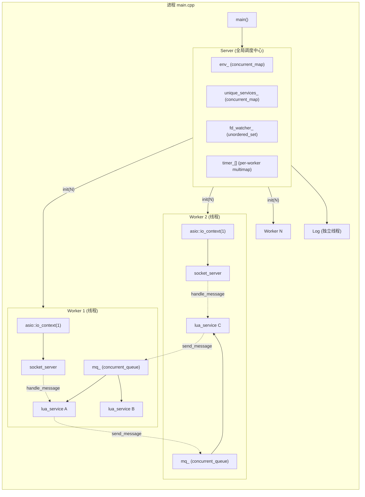
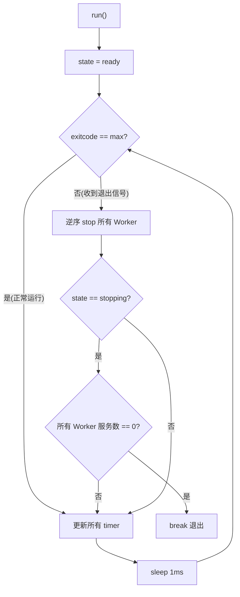
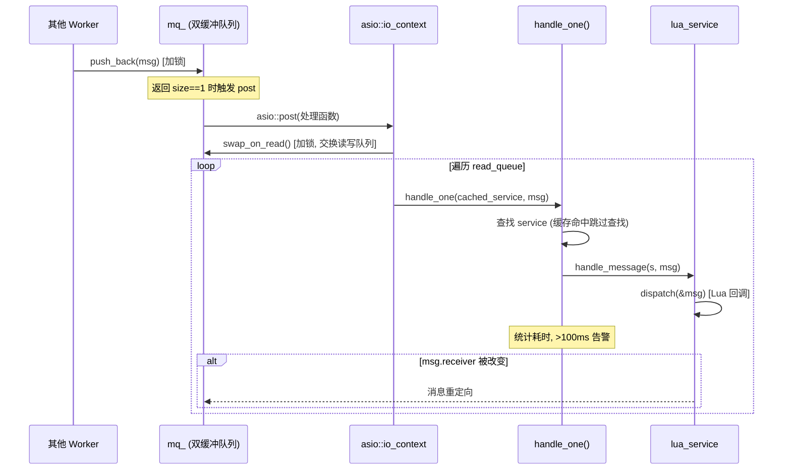
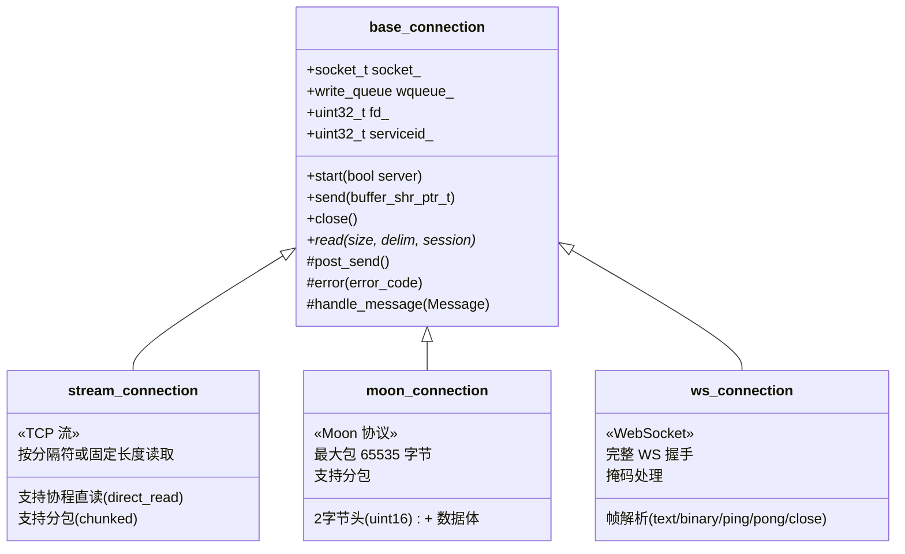
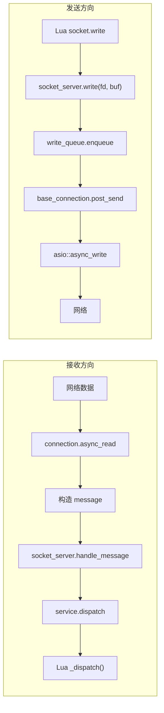
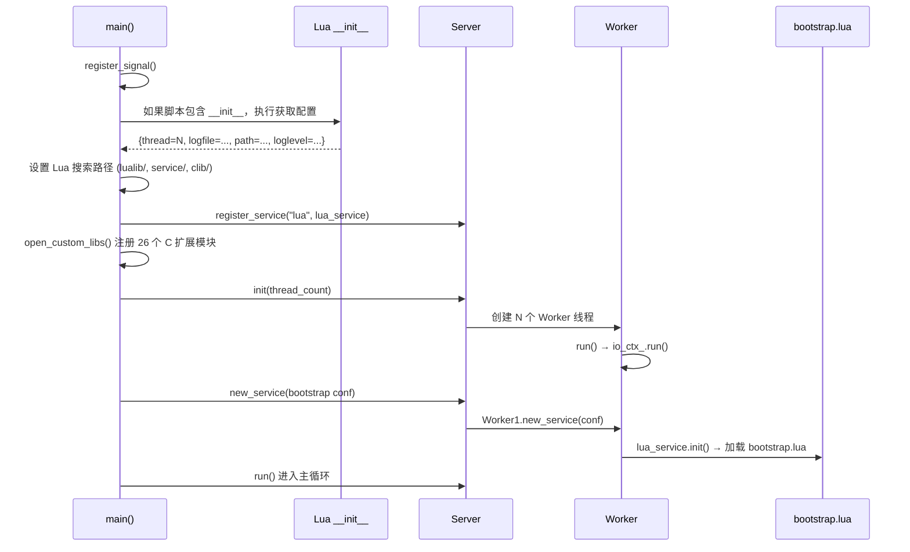
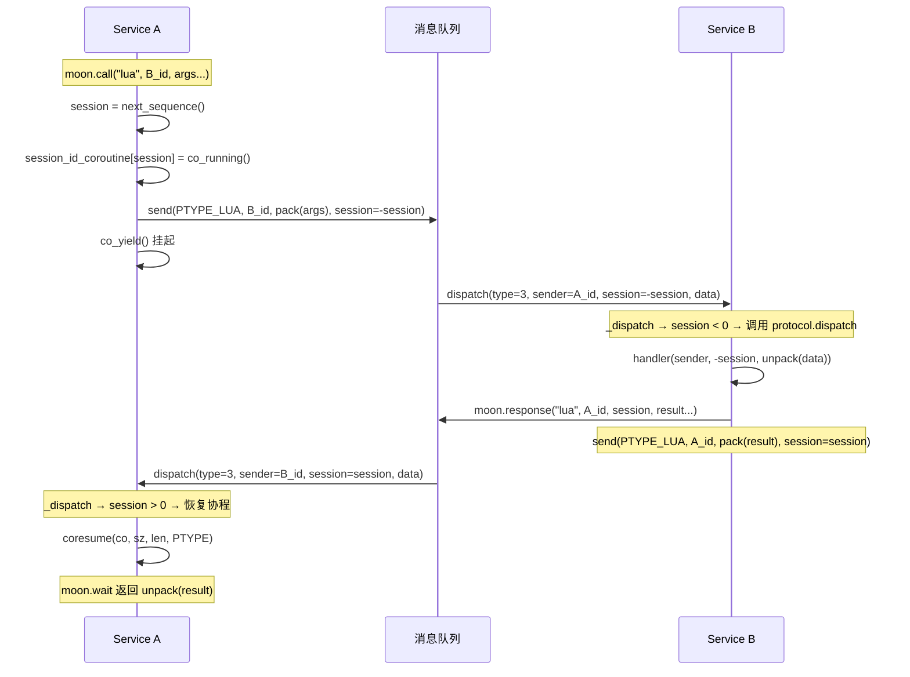

# Moon 框架技术备忘录

> 基于源码阅读的详细技术备忘录，面向自己查阅。

---

## 一、整体架构



### 关键设计决策

| 设计选择 | 实现方式 | 为什么这样做 |
|----------|----------|-------------|
| 每 Worker 一个 io_context | `io_ctx_(1)` 单线程 | 避免多线程竞争 io_context，每个 Worker 线程独享自己的事件循环 |
| 消息队列用双缓冲 | `concurrent_queue` swap-on-read | 写端只需一次 mutex lock push，读端 swap 后无锁遍历，最小化锁竞争 |
| Service ID 编码 Worker ID | 高 8 位 = worker_id | 路由消息时 O(1) 定位目标 Worker，不需要全局查表 |
| 每 Service 独立 Lua VM | `lua_newstate(lalloc, this)` | Actor 隔离，避免 Lua 全局状态污染，可独立限制每个服务的内存 |
| 定时器在 Server 主线程驱动 | `timer_->update(now_)` 每 1ms | 定时器精度统一，回调通过消息发到对应 Worker |
| FD 全局分配 | `fd_seq_` 原子递增 | 跨 Worker 的连接标识需要全局唯一 |

---

## 二、Server — 全局调度中心

**源码**: [server.h](src/moon/core/server.h) | [server.cpp](src/moon/core/server.cpp)

### 核心 API

```cpp
// 初始化：创建 N 个 Worker 线程，每个 Worker 配一个 timer
void init(uint32_t worker_num);

// 主循环：1ms 精度驱动定时器，监控退出信号，等待所有 Worker 服务关闭
int run();

// 停止：设置 exitcode，触发所有 Worker 的 stop()
void stop(int exitcode);

// 消息路由：从 receiver 的 service_id 提取 worker_id，投递到对应 Worker 的 mq
bool send_message(message&& msg) const;

// send 封装：session 取反（负数表示这是一个 call 请求）
bool send(uint32_t sender, uint32_t receiver, buffer_ptr_t buf, int64_t sessionid, uint8_t type) const;

// 广播：clone buffer 发给所有 Worker
void broadcast(uint32_t sender, const buffer& buf, uint8_t type) const;

// 创建服务：优先分配到指定 threadid 的 Worker，否则负载均衡
void new_service(std::unique_ptr<service_conf> conf);

// 负载均衡：选择服务数最少的 shared Worker
worker* next_worker();

// 定时器：interval <= 0 立即触发（post 消息），否则加入对应 Worker 的 timer multimap
void timeout(int64_t interval, uint32_t serviceid, int64_t timerid);

// 全局环境：线程安全的 KV 存储（读写锁）
void set_env(std::string name, std::string value);
std::shared_ptr<const std::string> get_env(const std::string& name) const;

// 唯一服务注册
bool set_unique_service(std::string name, uint32_t v);
uint32_t get_unique_service(const std::string& name) const;

// FD 管理
uint32_t nextfd();          // 原子递增，try_lock 确保唯一
bool try_lock_fd(uint32_t); // unordered_set + mutex
void unlock_fd(uint32_t);

// 运行信息
std::string info() const;   // JSON 格式：socket数/timer数/log数/service数/error数 + 每 Worker 的 cpu/mq/service
```

### 主循环流程



### Service ID 编码方案

```
 31          24 23                               0
 +-----------+----------------------------------+
 | worker_id |          service_seq              |
 | (8 bits)  |          (24 bits)                |
 +-----------+----------------------------------+

 - worker_id: 1~255，最多 255 个 Worker
 - service_seq: 1 ~ 16777215 (2^24-1)
 - 路由: worker_id = (serviceid >> 24) & 0xFF
 - 第一个服务: BOOTSTRAP_ADDR = 0x01000001
```

---

## 三、Worker — 工作线程

**源码**: [worker.h](src/moon/core/worker.h) | [worker.cpp](src/moon/core/worker.cpp)

### 核心 API

```cpp
void run();                     // 启动线程：创建 socket_server，运行 io_ctx.run()
void stop();                    // 向所有服务 dispatch PTYPE_SHUTDOWN 消息
void wait();                    // io_ctx.stop() + thread.join()
void send(message&& msg);       // 投递消息到 mq_，触发 asio::post 处理
void new_service(conf);         // asio::post 到本线程创建服务
void remove_service(id, sender, session); // asio::post 销毁服务并广播退出通知
void scan(sender, sessionid);   // 返回本 Worker 所有服务信息 (JSON)
void signal(int val) const;     // 向当前正在执行的服务发送信号
```

### 消息处理流程（核心！）



**关键细节**:
- **缓存优化**: `handle_one` 缓存上一次处理的 service 指针，连续发给同一服务的消息避免重复 hash 查找
- **receiver == 0 的广播**: 遍历本 Worker 所有服务（跳过非 unique 的 SYSTEM 消息），用于系统广播
- **耗时告警**: 单条消息处理超过 100ms 输出 WARN 日志

### 服务创建流程

```cpp
new_service(conf):
  1. count_.fetch_add(1)                    // 先增计数（用于负载均衡判断）
  2. asio::post(io_ctx_, []{                // 投递到本线程执行
       3. allocate_service_id()             // 高8位=workerid, 低24位循环分配
       4. server_->make_service("lua")      // 创建 lua_service 实例
       5. s->set_server_context(server_, this)
       6. s->init(conf)                     // 加载 Lua 脚本
       7. services_.emplace(id, s)          // 注册到 Worker
       8. send(PTYPE_INTEGER, creator, session, id) // 回复创建者 service id
     })
```

---

## 四、双缓冲并发队列

**源码**: [concurrent_queue.hpp](src/common/concurrent_queue.hpp)

### 算法原理

```
写入端 (多线程):                       读取端 (单线程):
┌──────────────┐                    ┌──────────────┐
│ write_queue_ │  ← push_back()    │ read_queue_  │  → 遍历处理
│  [msg1]      │    (mutex lock)    │  (空)        │
│  [msg2]      │                    │              │
│  [msg3]      │                    │              │
└──────────────┘                    └──────────────┘

swap_on_read() (mutex lock, O(1) swap):
┌──────────────┐                    ┌──────────────┐
│ write_queue_ │  (空, 接受新写入)  │ read_queue_  │  → [msg1, msg2, msg3]
└──────────────┘                    └──────────────┘
```

**为什么用双缓冲而不是无锁队列？**
- 写入只需一次 lock (push_back)
- 读取只在 swap 时 lock 一次，然后无锁遍历整个批次
- 适合「多写少读」的消息队列场景（消息积攒后批量处理）

**Worker.send 的触发机制**:
```cpp
void worker::send(message&& msg) {
    if (mq_.push_back(std::move(msg)) == 1) {  // 队列从空变非空
        asio::post(io_ctx_, [this]() {          // 只在第一条消息时 post
            auto& read_queue = mq_.swap_on_read();
            // 处理所有消息...
        });
    }
}
```
> 精妙之处：只有队列从 0→1 时才 post，避免重复 post。后续消息只是追加到 write_queue，等当前 post 的 handler 执行 swap 时一起处理。

### mpsc_queue（备用）

文件中还包含一个 **无锁 MPSC 队列** 实现（多生产者单消费者），基于原子操作的链表：
- `push_back`: `head_.exchange` + `prev->next_.store` (lock-free)
- `pop`: 从 tail 端消费
- 当前框架未使用此队列，保留作为可选方案

---

## 五、定时器

**源码**: [timer.hpp](src/common/timer.hpp)

### 实现：基于 std::multimap

```cpp
template<typename ExpirePolicy>
class base_timer {
    std::mutex lock_;
    std::multimap<int64_t, expire_policy_type> timers_;  // key=到期时间戳
    std::vector<expire_policy_type> expired_;             // 本次 update 到期的
};
```

**update 流程**:
```cpp
void update(int64_t now) {
    // 1. 加锁，取出所有 key <= now 的定时器
    auto it = timers_.begin();
    while (it != timers_.end() && it->first <= now) {
        expired_.push_back(std::move(it->second));
        it = timers_.erase(it);
    }
    // 2. 解锁后执行回调（不持锁执行用户代码）
    for (auto& handler : expired_) {
        handler();  // → server::on_timer → send PTYPE_TIMER 消息
    }
}
```

**为什么用 multimap 而非时间轮？**
- 实现简单，代码量少（82 行）
- multimap 的 insert/erase 都是 O(log N)
- 游戏服务器的定时器数量通常不会特别大（几千到几万级别）
- update 只需遍历已到期的部分，不需要扫描全部

**定时器回调链**:
```
Server.timeout(interval, serviceid, timerid)
  → timer_.add(now + interval, {serviceid, timerid, server})
  → [到期] timer_expire_policy::operator()()
    → server->on_timer(serviceid, timerid)
      → send_message(PTYPE_TIMER, receiver=serviceid, session=0, data=timerid)
        → Worker.mq_.push_back(msg)
          → lua_service.dispatch(msg)
            → Lua: _dispatch(PTYPE_TIMER, ...)
              → timer_routine[timerid]()  // 执行 Lua 回调或恢复协程
```

---

## 六、日志系统

**源码**: [log.hpp](src/moon/core/log.hpp) (320 行)

### 架构：独立线程 + 双缓冲异步写入

Moon 的日志系统采用**生产者-消费者**模型，业务线程零阻塞写日志：

```
业务线程 (Worker / Server)              日志线程 (独立)
┌──────────────────────┐            ┌──────────────────────┐
│ log::logstring()     │            │ log::write()         │
│   → make_line()      │            │   → swap_on_read()   │
│   → push(log_queue_) │ ──swap──→  │   → do_write()       │
│   (mutex, O(1))      │            │     ├→ 终端彩色输出  │
└──────────────────────┘            │     └→ 文件写入      │
                                    └──────────────────────┘
```

- **日志队列**：复用框架的 `concurrent_queue<buffer>` 双缓冲队列，写入端只需一次加锁 push，日志线程 swap 后批量写入；
- **独立线程**：构造函数中直接启动 `std::thread(&log::write, this)`，生命周期与进程一致；
- **自适应休眠**：日志线程空闲时采用指数退避休眠（1ns → 2ns → ... → 16ms），有日志时立刻恢复为 1ns 间隔，兼顾低延迟与低 CPU 占用。

### 日志级别

```cpp
enum class LogLevel : char { Error = 1, Warn, Info, Debug, Max };
```

| 级别 | C++ 宏 | Lua API | 终端颜色 | 说明 |
|------|--------|---------|----------|------|
| Error | `CONSOLE_ERROR(fmt, ...)` | `moon.error(...)` | 🔴 红色 | 错误，自动 flush 文件缓冲 |
| Warn | `CONSOLE_WARN(fmt, ...)` | `moon.warn(...)` | 🟡 黄色 | 警告 |
| Info | `CONSOLE_INFO(fmt, ...)` | `moon.info(...)` | ⚪ 白色 | 信息 |
| Debug | `CONSOLE_DEBUG(fmt, ...)` | `moon.debug(...)` | 🟢 绿色 | 调试 |

- C++ 宏 `CONSOLE_WARN/ERROR/DEBUG` 会自动附加 `__FILENAME__` 和 `__LINE__`，方便定位源码位置；
- Lua 层 `lmoon_log` 会通过 `lua_getstack` + `lua_getinfo("Sl")` 自动追加 Lua 源文件名和行号。

### 日志行格式

每条日志的内部 `buffer` 布局：

```
┌───────┬───────┬────────────────────────┬───────┬─────────┬──────────────┐
│ 控制台 │ 级别  │ 时间戳 (毫秒精度)       │ 级别名 │ 服务ID  │ 日志正文     │
│ (1B)  │ (1B)  │ 2026-10-03 11:42:03.123│ INFO| │:01000001│ Hello world  │
└───────┴───────┴────────────────────────┴───────┴─────────┴──────────────┘
```

- 前 2 字节为元信息（是否输出到终端、日志级别），不会写入文件；
- 服务 ID 以 8 位十六进制显示（如 `:01000001`），无服务上下文时显示线程 ID；
- Error 级别日志会立刻 `fflush`，其余级别批量 flush。

### 核心 API

```cpp
// C++ 层
log::instance().init("logs/server.log");      // 初始化日志文件
log::instance().set_level(LogLevel::Info);     // 设置过滤级别
log::instance().set_enable_console(true);      // 开启/关闭终端输出
log::instance().logfmt(true, level, fmt, ...); // 格式化写入
log::instance().logstring(true, level, str);   // 字符串写入
log::instance().size();                        // 当前队列中待写日志数
log::instance().error_count();                 // 累计错误计数
```

```lua
-- Lua 层
moon.error("player", player_id, "login failed")  -- 自动用 tab 分隔多参数
moon.warn("connection timeout")
moon.info("server started")
moon.debug("detail:", some_table)
moon.loglevel("INFO")                             -- 动态调整日志级别
```

---

## 七、Buffer — 核心数据容器

**源码**: [buffer.hpp](src/common/buffer.hpp) (540 行)

### 内存布局

```
capacity (2的幂次)
|←————————————————————————————————————————————————→|
┌─────────────┬──────────────────┬────────────────┐
│ 已消费区域  │    可读数据      │   可写空间     │
│  (consumed) │  data() ~ size() │  (writeable)   │
└─────────────┴──────────────────┴────────────────┘
↑             ↑                  ↑                ↑
0          readpos           writepos          capacity
```

### 关键设计

- **2 的幂次容量**: `next_pow2()` 确保容量总是 2 的幂，位运算友好
- **compressed_pair**: 利用 EBO（空基类优化）将 allocator 和数据放在一起，`bitmask` 用 8 位存储标记位（如 socket_send_mask）
- **准备写入**: `prepare(need)` 先尝试原地扩展，不够则 memmove 前移已读数据，还不够则 realloc
- **mimalloc 支持**: 编译时可选 `mi_stl_allocator<char>` 替换标准分配器
- **write_front**: 向 readpos 之前写入（协议头前插），要求 readpos 有足够空间

### 核心 API

```cpp
void write_back(std::string_view data);          // 追加写入（自动扩容）
void write_back(T val);                          // 写入算术类型
bool write_front(const T* data, size_t count);   // 头部写入（不扩容，需要预留空间）
bool read(T* out, size_t count);                 // 读取并前进 readpos
bool consume(size_t n);                          // 跳过 n 字节
bool seek(size_t offset, seek_origin);           // 设置 readpos
bool commit(size_t n);                           // 前进 writepos（用于外部写入后确认）
pair<pointer, size_t> prepare(size_t need);      // 准备写入空间
void shift_data(idx, count, new_idx);            // 内部数据搬移（memmove）
base_buffer clone() const;                       // 深拷贝
```

---

## 八、网络层

**源码**: [socket_server.h](src/moon/core/network/socket_server.h) | [base_connection.hpp](src/moon/core/network/base_connection.hpp)

### 连接类型对比



### 发送队列 (write_queue)

- 支持设置 **warn_size** 和 **error_size**
- 超过 warn_size 输出警告
- 超过 error_size 强制断开连接（防止内存泄漏）
- 发送完最后一个标记了 `socket_send_mask::close` 的 buffer 后自动关闭连接

### 网络数据流



### 协议层封包与解包规范 (Network Framing)

在 Moon 框架中，不同连接类型拥有严格的二进制封包规范与状态转换机制：

#### 1. Moon 协议 (`moon_connection`)
针对游戏高频小包与突发大包混合场景设计的二进制封包格式：
- **包头格式**：固定 2 字节（`uint16_t`，网络字节序/大端序），表示 Payload 长度。
- **单包最大限制**：常规情况下单包长度最大为 `65534` 字节。
- **分包机制 (Chunked Transfer)**：
  - 当数据包体超过单包上限（`>= 65535`）时，若启用了 `connection_mask::chunked_send`，框架会将包体切片为多个 `65535` 长度的分片陆续发送。
  - 终止标记：尾部分片以长度为 `0` 的包头作为流结束标志。
  - 接收端通过 `chunked_recv` 标志在底层拼装完整的消息后才向上层 Lua 投递，业务层无需手动拼包。

```
常规包 (<= 65534):
┌───────────────┬──────────────────────────────┐
│ Length (2B)   │ Payload (N bytes)            │
└───────────────┴──────────────────────────────┘

超大包切片 (Chunked):
┌───────┬──────────────┬───────┬──────────────┬───────┬───────┐
│ 0xFFFF│ Slice 1 (65K)│ 0xFFFF│ Slice 2 (65K)│ 0x0000│ (End) │
└───────┴──────────────┴───────┴──────────────┴───────┴───────┘
```

#### 2. 流式协议 (`stream_connection`)
- 支持按**定长字节数**或**指定分隔符（如 `\r\n`）**读取；
- 具备**协程直读（Direct Read）**能力：当上层服务发起 `asio.core.read(fd, session, count, delim)` 时，连接对象会挂起当前协程，直接将后续到达的网络缓冲区切分并恢复给目标协程，避开额外的队列路由开销。

#### 3. 动态协议切换流程 (Protocol Switch)
Moon 支持在一个 Socket 上动态切换协议（如 HTTP 握手升级为 WebSocket 或自定义私有二进制协议）：

```lua
-- 1. 监听连接并接收客户端请求（初始为 stream 类型）
local fd = asio.listen("0.0.0.0", 8080, PTYPE_TCP)
local client_fd = asio.accept(fd, service_id)

-- 2. 读取握手请求头（按行读取）
local header = asio.read(client_fd, "\r\n\r\n")

-- 3. 协议升级：将当前连接切换为 WebSocket 或 Moon 协议
-- 切换后底层网络驱动将自动改变解包与封包解析器
asio.switch_type(client_fd, PTYPE_WEBSOCKET)
```

---

## 九、HTTP 协议栈与 Web 服务

Moon 内部集成了一套轻量且高性能的原生 HTTP 协议栈，覆盖**HTTP 报文极速解析**、**路由分发与中间件**、**静态资源托管**以及**异步非阻塞 HTTP Client**。

**源码**:
- C++ 报文解析: [lua_http.cpp](src/lualib-src/lua_http.cpp) | [http_utility.hpp](src/common/http_utility.hpp) (注册为 `http.core`)
- Lua 服务端驱动: [server.lua](lualib/moon/http/server.lua)
- Lua 客户端驱动: [client.lua](lualib/moon/http/client.lua)
- 协议核心与连接池: [internal.lua](lualib/moon/http/internal.lua)

---

### 1. C++ 零拷贝流式解析器 (`http.core`)

底层封装了高性能 HTTP 状态机解析器（`http::request_parser` 与 `http::response_parser`），结合 `std::string_view` 实现零拷贝字段切片：

- **请求行解析**: 解析出 Method (`GET`/`POST` 等)、原始 Path（自动执行 `percent::decode` 解码 URL 编码字符）、Query String 以及 HTTP 协议版本（如 `HTTP/1.1`）；
- **大小写无关 Header 映射**: HTTP 规范要求请求头字段大小写不敏感，C++ 层在构建 Lua Table 时自动将键转换为全小写（如 `Content-Type` → `headers["content-type"]`），消除上层业务因大小写不一致导致的寻址 Bug；
- **辅助函数**: 提供 C 级别的 `urlencode`、`urldecode` 以及高效查询参数序列化 `create_query_string`。

---

### 2. HTTP Server 架构与运行模型

#### 请求生命周期与连接复用 (Keep-Alive)
- **非阻塞监听**: `http_server.listen(host, port, timeout)` 监听 TCP 端口并异步 accept 连接；
- **长连接与管道化支持**: 默认启用 `keepalive = true`。处理完一条请求后，根据客户端传来的 `Connection: close` 标头或服务端自身策略决定是否复用 Socket 继续读取下一条请求，减少高频短连接带来的三次握手与 TIME_WAIT 开销；
- **Chunked 分块传输与大包防御**:
  - `header_max_len`: 限制请求头最大字节数（默认 `8192` 字节），防御慢速溢出攻击；
  - `content_max_len`: 针对分块或大请求体可设置上限阈值，超过限制自动截断报错。

#### 路由机制与洋葱中间件 (`fallback`)
HTTP Server 支持精准路径匹配与拦截器式级联回调：
1. **精准路由**: `http_server.on("/api/login", handler)` 注册端点处理逻辑；
2. **中间件链式调用 (`fallback`)**: 采用洋葱模型（类似 Koa/Express 中间件机制）。通过传入 `next()` 回调逐层传递控制权，未匹配时触发默认 404：

```lua
local http_server = require("moon.http.server")

-- 1. 全局耗时与鉴权中间件
http_server.fallback(function(request, response, next)
    local start_time = moon.time()
    next() -- 移交至下一个中间件或路由处理函数
    local cost = moon.time() - start_time
    response:write_header("X-Response-Time", string.format("%dms", cost))
end)

-- 2. 业务 API 路由
http_server.on("/api/user", function(request, response)
    local query = request:parse_query()
    local uid = query.uid
    response:write_header("Content-Type", "application/json")
    response:write(string.format('{"code":0,"uid":%s}', uid))
end)

-- 3. 静态 Web 资源托管 (一键托管前端打包目录)
http_server.static("./static")

-- 4. 监听端口 (超时时间 10 秒)
http_server.listen("0.0.0.0", 8080, 10)
```

---

### 3. 异步 HTTP Client 与长连接复用池

#### 协程无缝挂起与响应唤醒
当业务服务发起外部 Web 请求时，当前协程自动挂起（Yield），利用底层 Asio 异步套接字与远端握手通信，完全不会阻塞 Worker 线程的其他 Service。

#### 核心 API 速查
```lua
local http_client = require("moon.http.client")

-- 1. GET 请求
local res = http_client.get("https://api.example.com/status", {
    timeout = 5000, -- 毫秒
    headers = { ["Authorization"] = "Bearer token123" }
})
if res.status_code == 200 then
    print("Response body:", res.body)
end

-- 2. POST JSON 数据 (自动序列化与反序列化)
local post_res = http_client.post_json("http://127.0.0.1:8080/api/report", {
    server_id = 1,
    online_count = 1024
})
if post_res.status_code == 200 then
    print("Parsed JSON code:", post_res.body.code)
end

-- 3. POST 表单数据 (x-www-form-urlencoded)
local form_res = http_client.post_form("http://127.0.0.1:8080/api/auth", {
    account = "admin",
    password = "secret_password"
})
```

#### 连接池优化 (`keep_alive_host`)
- 客户端驱动内部维护了针对各目标 Host 的 `keep_alive_host` 空闲连接池（默认单 Host 最大缓存 `10` 个活跃连接）；
- 对同一个第三方 Web 服务器或微服务发起连续调用时，自动拾取闲置连接复用，避免每发一次 HTTP 请求都经历 TCP 握手。

---

## 十、WebSocket 协议与网关实现

Moon 内置了针对游戏长连接场景（如 H5 游戏、微端、前端管理后台实时通信）的高性能原生 WebSocket 协议驱动，支持**协议平滑握手升级**、**C++ 掩码位运算零拷贝还原**以及**Lua 服务端/客户端双向通信**。

**源码**:
- C++ 协议底层驱动: [ws_connection.hpp](src/moon/core/network/ws_connection.hpp) (574 行)
- Lua 高层封装与事件绑定: [websocket.lua](lualib/moon/http/websocket.lua) (注册协议 `PTYPE_SOCKET_WS = 10`)

---

### 1. 协议握手协商与动态升级 (`HTTP 101 Switching Protocols`)

#### 握手安全校验规范 (RFC 6455)
无论是作为服务端接入还是作为客户端外联，Moon 均严格遵循 WebSocket 握手规范：
1. **客户端请求头**: 发送 `Upgrade: websocket`、`Connection: Upgrade`，携带 16 字节随机密钥经过 Base64 编码的 `Sec-WebSocket-Key`；
2. **服务端验证计算**:
   - 提取 `Sec-WebSocket-Key`，拼装标准魔数 UUID `258EAFA5-E914-47DA-95CA-C5AB0DC85B11`；
   - 依次执行 SHA-1 摘要散列计算与 Base64 编码，生成 `Sec-WebSocket-Accept`；
   - 校验通过后，返回 `101 Switching Protocols` 响应报文；
3. **协议动态切换 (`switch_type`)**:
   - 底层调用 `socket.switch_type(fd, moon.PTYPE_SOCKET_WS)`，将该 Socket 由通用流模式转换为 `ws_connection` 帧驱动模式。从此该连接的所有网络收发交由 WebSocket 数据帧解析器接管。

---

### 2. C++ 数据帧解析与异或掩码解码

底层 [ws_connection.hpp](src/moon/core/network/ws_connection.hpp) 实现了高效的帧状态机：

#### 帧结构与字段控制
```
 0                   1                   2                   3
 0 1 2 3 4 5 6 7 8 9 0 1 2 3 4 5 6 7 8 9 0 1 2 3 4 5 6 7 8 9 0 1
+-+-+-+-+-------+-+-------------+-------------------------------+
|F|R|R|R| opcode|M| Payload len |    Extended payload length    |
|I|S|S|S|  (4)  |A|     (7)     |             (16/64)           |
|N|V|V|V|       |S|             |   (if payload len==126/127)   |
| |1|2|3|       |K|             |                               |
+-+-+-+-+-------+-+-------------+ - - - - - - - - - - - - - - - +
|     Extended payload length continued, if payload len == 127  |
+ - - - - - - - - - - - - - - - +-------------------------------+
|                               |Masking-key, if MASK set to 1  |
+-------------------------------+-------------------------------+
| Masking-key (continued)       |          Payload Data         |
+-------------------------------- - - - - - - - - - - - - - - - +
:                     Data bytes (XOR unmasked)                 :
+---------------------------------------------------------------+
```

- **变长长度支持**:
  - `payload_len <= 125`: 直接表示包体长度；
  - `payload_len == 126`: 额外读取 2 字节（`uint16_t` 大端序）；
  - `payload_len == 127`: 读取 8 字节（`uint64_t` 大端序，服务端防恶意大包默认有安全阈值保护）；
- **高性能掩码还原 (`Unmask`)**:
  - 客户端上行必须包含 4 字节 `mask_key`；
  - C++ 驱动利用位运算快速还原：`data[i] ^= mask_key[i & 3]`，内存无需重新拷贝或二次分配；
- **控制帧与连接保活**:
  - `Ping (Opcode 9)` / `Pong (Opcode 10)`: 自动映射为 `socket_ping` / `socket_pong` 消息事件，保证心跳状态实时跟踪；
  - `Close (Opcode 8)`: 安全触发断开流程，关闭套接字并向上层通知连接销毁。

---

### 3. Lua 层网关服务端与客户端实践

#### 服务端快速搭建
```lua
local moon = require("moon")
local websocket = require("moon.http.websocket")

-- 1. 监听 WebSocket 端口
local listen_fd = websocket.listen("0.0.0.0", 9001)

-- 2. 握手连接建立回调 (可获取客户端请求头、Cookie、Token)
websocket.on_accept(function(fd, request_header)
    moon.info("WebSocket connected:", fd, "User-Agent:", request_header["user-agent"])
end)

-- 3. 消息到达事件监听
websocket.wson("message", function(fd, msg)
    local data = moon.decode(msg, "Z") -- 获取二进制/文本 Payload
    moon.info("Recv from", fd, data)
    
    -- 回包：发送文本或二进制消息
    websocket.write_text(fd, "echo: " .. data)
end)

-- 4. 心跳 Ping/Pong 事件监听
websocket.wson("ping", function(fd, msg)
    -- 收到客户端 Ping 时自动或手动回 Pong 保活
    websocket.write_pong(fd, "pong")
end)

-- 5. 客户端断开连接回调
websocket.wson("close", function(fd, msg)
    moon.warn("WebSocket client closed:", fd)
end)
```

#### 客户端外联实践 (`websocket.connect`)
```lua
-- 作为客户端主动连接外部 WebSocket 服务（自动完成 RFC 6455 握手并升级连接）
local client_fd = websocket.connect("ws://127.0.0.1:9001/chat", {
    ["Sec-WebSocket-Protocol"] = "chat, superchat"
}, 5000)

-- 发送数据
websocket.write_text(client_fd, "Hello Server!")
```

---

## 十一、KCP 可靠 UDP 传输机制

在弱网竞技、帧同步、MOBA/FPS 移动游戏战斗服中，传统的 TCP 拥塞控制和丢包重传策略会导致不可控的握手阻塞与高延迟波动（RTT 尖刺）。Moon 内部集成了 ARQ 工业级协议 **KCP**，并通过 C++ 扩展与 Asio UDP 异步套接字打通，提供高吞吐、极低延迟的可靠传输管道。

**源码**:
- C++ 驱动与协议绑定: [lua_kcp.cpp](src/lualib-src/lua_kcp.cpp) (`kcp.core`) | [ikcp.h](third/kcp/ikcp.h) / [ikcp.c](third/kcp/ikcp.c)
- Lua 层服务驱动与连接生命周期: [kcp.lua](lualib/moon/kcp.lua)

---

### 1. KCP 与 Asio UDP 桥接架构

KCP 协议本身**不负责底层网络 Socket 的收发**，它是一个纯内存状态机（基于回调驱动）。Moon 将其与 Asio UDP 完美解耦结合：

```
[网络层: 物理网卡 UDP 数据报]
           │
           │ socket.udp / socket.sendto
           ▼
┌──────────────────────────────────────────────────────────┐
│ Lua 层连接调度中心 (kcp.lua)                             │
│                                                          │
│  握手管理: SYN / ACK (分配全局唯一会话 conv)             │
│  时钟驱动: 10ms 高频 update 定时器循环                   │
└──────────────────────────┬───────────────────────────────┘
                           │
             core.input    │    core.output
                           ▼
┌──────────────────────────────────────────────────────────┐
│ C++ 驱动层 (lua_kcp.cpp / ikcpcb)                        │
│                                                          │
│  - 状态管理: struct box { wqueue, rbuf (8KB), session }   │
│  - 弱网重传: 快速重传 (2次跨跳) + 极速 RTO (rx_minrto=10) │
│  - 流模式传输: stream = 1 (自动拼装与切片)               │
│  - 发送/接收窗口: 1024 / 1024                            │
└──────────────────────────────────────────────────────────┘
```

- **`box` 容器隔离**: 为每个 KCP 会话分配专用上下文指针，内嵌 `wqueue`（待发送 UDP 队列）和 `rbuf`（接收缓冲双缓冲切片），多连接并发零锁争用；
- **流式传输 (`stream = 1`)**: 启用 KCP Stream 模式，上层业务调用 `kcp.send` 时无需关心 UDP 单包 MTU 分片大小，底层自动拼装并保证字节序完整。

---

### 2. 弱网极致抗抖动参数调优

Moon 源码在初始化每个 KCP 实例时（[lua_kcp.cpp:L24](src/lualib-src/lua_kcp.cpp#L24)），均针对游戏极端弱网对抗场景应用了极致低延迟调优配置：

```cpp
ikcp_wndsize(kcp, 1024, 1024);     // 发送/接收滑动窗口均扩展至 1024 报文
ikcp_nodelay(kcp, 1, 10, 2, 1);    // 启动极速模式：
                                   // 1: 启用 nodelay (关闭拥塞机制等待)
                                   // 10: 内部 tick 刷新周期 10ms
                                   // 2: 快速重传 (跳过 2 个 ACK 立即触发重传，无需等待 RTO 超时)
                                   // 1: 关闭常规拥塞控制 (nc=1，防止窗口因丢包断崖式跌落)
kcp->rx_minrto = 10;               // 最小重传超时仅为 10ms (标准 TCP 默认通常在 200ms~1000ms)
```

- **效果**: 在丢包率高达 10%~20% 的恶劣蜂窝网络环境下，重传响应通常在 10~20ms 内极速完成，完全避免了 TCP 常见的半秒卡顿现象。

---

### 3. 三次握手与会话管理模型 (`SYN` / `ACK`)

由于 UDP 无状态，Moon 在应用层实现了轻量可靠握手：
1. **客户端发起 SYN**: `socket.write(fd, "SYN")`；
2. **服务端确认分配并回传 ACK**:
   - 服务端监听端收到 `"SYN"` 报文，生成自增会话号 `conv`（1 ~ 0x7FFFFFFF）；
   - 回传报文 `"ACK" .. string.pack(">I", conv)`；
3. **完成握手建连**: 客户端解出 `conv`，双端以该 `conv` 创建独立 KCP 实例，绑定远端 `endpoint`；
4. **心跳与超时清理**:
   - `recvtime` 追踪最近数据到达时间；
   - 若超过 `10` 秒未收到任何数据，自动判定为离线断开，释放底层 `ikcp_release` 内存，触发 `close_callback` 并唤醒挂起协程返回错误。

---

### 4. Lua 层 API 速查与收发范式

```lua
local moon = require("moon")
local kcp = require("moon.kcp")

-- 1. 服务端：监听 KCP 端口
kcp.listen("0.0.0.0", 9999, function(endpoint)
    moon.info("KCP client connected from:", moon.escape_print(endpoint))
    
    -- 启动异步接收协程
    moon.async(function()
        while true do
            -- 协程挂起读：读取指定长度的业务协议包 (如前置 2 字节表示长度)
            local header = kcp.read(endpoint, 2)
            if not header then break end
            
            local len = string.unpack(">I2", header)
            local body = kcp.read(endpoint, len)
            if not body then break end
            
            -- 回包测试
            local res = "Echo: " .. body
            kcp.send(endpoint, string.pack(">I2", #res) .. res)
        end
        moon.warn("KCP client disconnected:", moon.escape_print(endpoint))
    end)
end, function(endpoint)
    -- 连接断开回调
end)

-- 2. 客户端：连接 KCP 服务端 (带握手超时 3000ms)
moon.async(function()
    local client_fd = kcp.connect("127.0.0.1", 9999, 3000)
    if not client_fd then
        moon.error("KCP connect failed or timeout!")
        return
    end
    
    -- 发送可靠数据包
    local msg = "Hello KCP server!"
    kcp.send(client_fd, string.pack(">I2", #msg) .. msg)
end)
```

---

## 十二、LuaService — Lua 脚本服务

**源码**: [lua_service.h](src/moon/services/lua_service.h) | [lua_service.cpp](src/moon/services/lua_service.cpp)

### 内存管理

```cpp
void* lua_service::lalloc(void* ud, void* ptr, size_t osize, size_t nsize) {
    auto* l = static_cast<lua_service*>(ud);
    
    if (nsize == 0) { free(ptr); l->mem -= osize; return nullptr; }
    
    l->mem += (ssize_t)nsize - (ssize_t)osize;
    
    if (l->mem > l->mem_report) {
        if (l->mem > l->mem_limit) {
            // 超限：拒绝分配，输出 ERROR
            return nullptr;  // Lua 会触发内存错误
        }
        l->mem_report *= 2;  // 报告阈值翻倍：8MB→16MB→32MB→...
        // 输出 WARN
    }
    
    return realloc(ptr, nsize);
}
```

**关键点**:
- 通过 `LUA_EXTRASPACE` 存储 `lua_service*` 指针（Lua 5.4 特性），零开销获取服务上下文
- GC 策略：使用分代 GC (`LUA_GCGEN`)，初始化时先 stop GC 加载脚本，完成后 restart
- 全局 seed：所有 lua_service 共享一个原子种子，确保随机数初始化的确定性

### dispatch 调用链

```
C++ message → lua_service::dispatch(msg)
  → lua_pcall(L, 6, 0, trace_fn)
     参数: (type, sender, session, data_ptr/integer, size, msg_ptr)
  → Lua _dispatch(PTYPE, sender, session, sz, len, m)
     ├── session > 0: 响应消息 → 恢复等待的协程
     └── session <= 0: 请求消息 → protocol[PTYPE].dispatch(...)
```

---

## 十三、启动流程



### 注册的 26 个 C 扩展模块

| 注册名 | C 函数 | 功能 |
|--------|--------|------|
| `moon.core` | `luaopen_moon_core` | 核心 API (send/new_service/kill/env/timeout 等) |
| `asio.core` | `luaopen_asio_core` | 网络 API (listen/connect/read/write/close 等) |
| `socket.core` | `luaopen_socket_core` | Socket 高层封装 |
| `http.core` | `luaopen_http_core` | HTTP 协议解析 |
| `sharetable.core` | `luaopen_sharetable_core` | 共享表 |
| `fs` | `luaopen_fs` | 文件系统 |
| `seri` | `luaopen_serialize` | Lua 数据序列化 |
| `json` | `luaopen_json` | JSON 编解码 (yyjson) |
| `buffer` | `luaopen_buffer` | Buffer 操作 |
| `coroutine.profile` | `luaopen_coroutine_profile` | 协程性能分析 |
| `pb` | `luaopen_pb` | Protobuf |
| `crypt` | `luaopen_crypt` | 加密 |
| `aoi` | `luaopen_aoi` | AOI 区域兴趣 |
| `clonefunc` | `luaopen_clonefunc` | 函数克隆 |
| `random` | `luaopen_random` | 随机数 |
| `zset` | `luaopen_zset` | 排行榜 |
| `kcp.core` | `luaopen_kcp_core` | KCP 可靠 UDP |
| `bson` | `luaopen_bson` | BSON 编解码 |
| `mongo.driver` | `luaopen_mongo_driver` | MongoDB 驱动 |
| `navmesh` | `luaopen_navmesh` | 寻路 |
| `uuid` | `luaopen_uuid` | UUID 生成 |
| `schema` | `luaopen_schema` | 数据校验 |
| `fmt` | `luaopen_fmt` | 格式化 |
| `crypto.scram` | `luaopen_crypto_scram` | SCRAM-SHA256 认证 |
| `codecache` | `luaopen_cache` | Lua 代码缓存 (可选) |

### moon.core API 表

```lua
-- luaopen_moon_core 注册的函数:
moon.core = {
    clock        = lmoon_clock,         -- 高精度时钟 (秒, double)
    md5          = lmoon_md5,           -- MD5 哈希
    tostring     = lmoon_tostring,      -- lightuserdata → string
    timeout      = lmoon_timeout,       -- 设置定时器, 返回 timerid
    log          = lmoon_log,           -- 日志输出 (自动附加源码位置)
    loglevel     = lmoon_loglevel,      -- 获取/设置日志级别
    cpu          = lmoon_cpu,           -- 获取服务 CPU 使用量
    send         = lmoon_send,          -- 发送消息 (type, receiver, data, session, sender)
    new_service  = lmoon_new_service,   -- 创建服务
    kill         = lmoon_kill,          -- 销毁服务
    scan_services = lmoon_scan_services,-- 扫描 Worker 的服务列表
    queryservice = lmoon_queryservice,  -- 查询唯一服务 ID
    next_sequence = lmoon_next_sequence,-- 获取下一个序列号
    env          = lmoon_env,           -- 读写环境变量
    server_stats = lmoon_server_stats,  -- 服务器统计信息
    exit         = lmoon_exit,          -- 停止服务器
    now          = lmoon_now,           -- 当前时间戳 (可指定精度)
    adjtime      = lmoon_adjtime,       -- 调整时间偏移
    callback     = lua_service::set_callback, -- 设置消息回调
    decode       = message_decode,      -- 解码消息字段 (S=sender,R=receiver,E=session,Z=data,N=size,B=buffer,L=move_buffer,C=content)
    redirect     = message_redirect,    -- 重定向消息
    collect      = lmi_collect,         -- mimalloc GC
    escape_print = escape_print,        -- 转义打印
    signal       = moon_signal,         -- 向 Worker 发信号
    -- 常量
    id           = service_id,          -- 当前服务 ID
    name         = service_name,        -- 当前服务名
    timezone     = timezone_offset,     -- 时区偏移
}
```

### asio.core API 表

```lua
asio.core = {
    try_open          = lasio_try_open,          -- 测试端口可用性
    listen            = lasio_listen,            -- TCP 监听 → (fd, addr, port)
    accept            = lasio_accept,            -- 接受连接
    connect           = lasio_connect,           -- TCP 异步连接 → session
    read              = lasio_read,              -- 协程读 (按长度/分隔符)
    write             = lasio_write,             -- 发送数据 (支持 mask)
    write_message     = lasio_write_message,     -- 发送 message 的 buffer
    close             = lasio_close,             -- 关闭连接
    switch_type       = lasio_switch_type,       -- 切换协议类型
    settimeout        = lasio_settimeout,        -- 设置超时
    setnodelay        = lasio_setnodelay,        -- 设置 TCP_NODELAY
    set_enable_chunked = lasio_set_enable_chunked, -- 启用分包
    set_send_queue_limit = lasio_set_send_queue_limit, -- 发送队列限制
    getaddress        = lasio_address,           -- 获取远端地址
    udp               = lasio_udp,               -- 打开 UDP
    udp_connect       = lasio_udp_connect,       -- UDP 连接
    sendto            = lasio_sendto,            -- UDP 发送
    make_endpoint     = lasio_make_endpoint,     -- 构造 endpoint 二进制
    unpack_udp        = lasio_unpack_udp,        -- 解包 UDP (address + data)
}
```

---

## 十四、Lua 协程调度机制

**源码**: [moon.lua](lualib/moon.lua)

### 协程池

```lua
local co_pool = setmetatable({}, { __mode = "kv" })  -- 弱引用池

local function routine(fn, ...)
    local co = co_running()
    invoke(co, fn, ...)       -- 执行函数
    while true do
        invoke(co, co_yield()) -- 回池后等待复用
    end
end

function moon.async(fn, ...)
    local co = tremove(co_pool) or co_create(routine)  -- 优先复用
    coresume(co, fn, ...)
    return co
end
```

**设计要点**:
- 协程执行完后不销毁，yield 等待复用
- 弱引用表 (`__mode = "kv"`) 允许 GC 在内存紧张时回收空闲协程
- `co_num` 追踪活跃协程数量，用于监控

### RPC 请求-响应机制



**session 正负约定**:
- `session < 0`: C++ 层 `server::send` 将 session 取反传递，表示「请求」
- `session > 0`: 表示「响应」，用来匹配等待的协程
- `session == 0`: 普通单向消息，不期待响应

### _dispatch 核心逻辑

```lua
local function _dispatch(PTYPE, sender, session, sz, len, m)
    local p = protocol[PTYPE]
    
    if session > 0 then
        -- 响应消息：恢复等待的协程
        local co = session_id_coroutine[session]
        session_id_coroutine[session] = nil
        coresume(co, sz, len, PTYPE)  -- → moon.wait 返回 unpack(sz, len)
    else
        -- 请求/通知消息
        if not p.israw then
            local co = tremove(co_pool) or co_create(routine)
            coresume(co, p.dispatch, sender, session, p.unpack(sz, len))
        else
            p.dispatch(m)  -- 原始消息直接处理（不创建协程）
        end
    end
end
```

### Actor 协作避坑与死锁防范指南

在 Moon 的 Actor 模型中，由于服务间通信依赖消息传递与协程挂起，不当的调用链容易引发服务假死或内存泄漏。以下是开发核心准则：

#### 1. 规避环形 RPC 调用死锁 (Circular Call Deadlock)
- **成因**：当服务 A 调用 `moon.call(B)` 时，协程挂起等待；若服务 B 在处理过程中又同步调用 `moon.call(A)`，且两者逻辑相互等待对方的结果，会导致两个 Actor 产生死锁，协程永久挂起。
- **排查与规避方案**：
  - **原则 1：单向流转**。严格划分服务层级（如：`Gateway -> Scene -> Center -> DB`），只允许上层向下层 `call`，禁止逆向同步 `call`。逆向通知必须改用异步通知 `moon.send`。
  - **原则 2：优先使用 `moon.send`**。对于不需要立刻确认返回值的场景（如日志记录、状态同步、跨服事件广播），一律使用 `moon.send`，避免无谓占用 RPC 协程。

#### 2. 超时保护机制（防止协程永久悬挂）
默认的 `moon.call` 会一直等待直至接收端回复。如果目标服务崩溃退出或因网络堵塞未能回复，调用方协程将永远驻留在 `session_id_coroutine` 中无法被 GC 释放。

建议对关键外部调用封装带超时控制的 Call：

```lua
-- 封装带超时的 RPC 调用模式
function safe_call(PTYPE, receiver, timeout_ms, ...)
    local session = moon.send(PTYPE, receiver, ...) -- 开启会话
    local co = coroutine.running()
    
    -- 启动单次定时器进行兜底唤醒
    local timer_id = moon.timeout(timeout_ms, function()
        moon.wakeup(co, false, "TIMEOUT")
    end)
    
    -- 等待正常响应或超时唤醒
    local res, err = moon.wait(session)
    moon.remove_timer(timer_id) -- 及时注销定时器
    
    if not res and err == "TIMEOUT" then
        moon.warn(string.format("RPC call to [%d] timed out after %d ms", receiver, timeout_ms))
        return false, "TIMEOUT"
    end
    return res, err
end
```

#### 3. 避免在临界区中长时间阻塞或繁重计算
- 每个 Worker 线程单事件循环调度所有承载的 Services。若某一个 Service 内部进行了耗时较长的 CPU 密集型运算（例如无间断循环大矩阵计算），会导致同 Worker 下的所有其他 Service 的消息处理被饿死；
- **耗时预警**：框架内部已在 `worker::handle_one` 埋点，单条消息执行时间超过 `100ms` 会触发 WARN 告警日志。一旦出现该告警，需拆分任务或将计算转移至专门的 Worker 线程。

---

## 十五、协议注册系统

### 内置协议类型

| PTYPE | 名称 | pack | unpack | 特点 |
|-------|------|------|--------|------|
| 1 | system | `table.concat({...}, ",")` | 分割字符串 | israw=true, 系统内部广播 |
| 2 | text | 透传 | `moon.tostring` | 文本消息 |
| 3 | lua | `seri.pack` | `seri.unpack` | Lua 对象序列化，最常用 |
| 4 | error | 透传 | `return false, string` | 错误消息，unpack 返回 false |
| 5 | debug | `seri.pack` | `seri.unpack` | 远程调试命令 |
| 6 | shutdown | - | - | israw=true, 关闭信号 |
| 7 | timer | - | - | israw=true, 通过 timerid 查找回调 |
| 8 | tcp | 透传 | `moon.tostring` | TCP Socket 数据 |
| 9 | udp | 透传 | - | UDP Socket 数据 |
| 10 | websocket | 透传 | - | WebSocket 数据 |
| 11 | moonsocket | 透传 | - | Moon 协议 Socket 数据 |
| 12 | integer | 透传 | `return nval` | 整数消息 (如 service id) |
| 13 | log | 透传 | 解析 level + content | 远程日志 |

### 用户自定义协议

```lua
moon.register_protocol {
    name = "my_proto",
    PTYPE = 100,  -- 自定义协议号
    pack = function(...) return my_encode(...) end,
    unpack = function(sz, len) return my_decode(sz, len) end,
}

moon.dispatch("my_proto", function(sender, session, ...)
    -- 处理消息
end)
```

---

### Google Protobuf 协议集成 (`pb` & `protoc.lua`)

**源码**: [lua-protobuf](third/pb) (C 扩展模块 `pb`) | [protoc.lua](lualib/protoc.lua)

在绝大多数网游的客户端与服务端上行/下行通信中，Google Protocol Buffers (Protobuf) 是事实上的工业标准。Moon 深度集成了 `lua-protobuf`，并内置了纯 Lua 编写的语法分析器 `protoc.lua`：

#### 1. 核心优势：免安装 C++ protoc 动态编译
- **传统痛点**: 通常开发时需要安装 Google 官方的 `protoc.exe`，每次修改协议都必须跑脚本预先烘焙成 `.pb` 二进制描述符，流程割裂；
- **Moon 方案**: 利用内置的 `protoc.lua`，在服务启动时**直接将 `.proto` 文本文件动态编译为内存抽象语法树**并注册到底层 C 模块，所见即所得。

#### 2. 自定义 PTYPE_PB 协议注册范式
可以将 Protobuf 注册为一个全局协议，实现自动反序列化：

```lua
local moon = require("moon")
local pb = require("pb")
local protoc = require("protoc")

-- 1. 动态加载 proto 结构定义 (直接写文本或 loadfile 读取)
assert(protoc:load([[
    syntax = "proto3";
    package game;

    message C2S_Login {
        string account = 1;
        string token = 2;
    }

    message S2C_Login {
        int32  code = 1;
        int64  uid = 2;
    }
]]))

-- 2. 注册为 Moon 自定义协议
local PTYPE_PB = 20
moon.register_protocol {
    name = "protobuf",
    PTYPE = PTYPE_PB,
    pack = function(msg_name, t)
        return pb.encode(msg_name, t) -- 自动编码为二进制
    end,
    unpack = function(sz, len)
        return moon.tostring(sz, len) -- 保持原始字节流由业务按协议名解包
    end
}

-- 3. 编解码速查
local req_bytes = pb.encode("game.C2S_Login", { account = "test_user", token = "xyz123" })
local req_data  = pb.decode("game.C2S_Login", req_bytes)
print("玩家账号:", req_data.account)
```

---

## 十六、Lua 层核心 API 速查

### 服务管理

```lua
-- 创建服务 (async)
local id = moon.new_service {
    name = "chat",
    file = "service_chat.lua",
    unique = true,          -- 可选, 全局唯一
    threadid = 2,           -- 可选, 指定 Worker
    memlimit = 256*1024*1024, -- 可选, 内存限制
}

-- 查询唯一服务
local id = moon.queryservice("chat")

-- 销毁当前服务
moon.quit()

-- 强制销毁其他服务
moon.kill(service_id)

-- 扫描 Worker 上的服务 (async)
local json = moon.scan_services(worker_id)

-- 注册关闭回调
moon.shutdown(function()
    -- 保存数据等清理工作
    moon.quit()
end)
```

### 消息通信

```lua
-- 单向发送 (自动 pack)
moon.send("lua", receiver, arg1, arg2, ...)

-- 原始发送 (不 pack)
moon.raw_send("lua", receiver, raw_data, session)

-- 请求-响应 (async, 自动 pack/unpack)
local result = moon.call("lua", receiver, arg1, arg2)

-- 响应请求
moon.response("lua", sender, session, result1, result2)

-- 注册消息处理器
moon.dispatch("lua", function(sender, session, ...)
    -- 处理消息
    if session ~= 0 then
        moon.response("lua", sender, session, "ok")
    end
end)
```

### 异步编程

```lua
-- 创建异步任务
moon.async(function()
    local result = moon.call("lua", target, "hello")
    moon.sleep(1000)
    moon.send("lua", target, "done")
end)

-- 等待 session 响应
local result = moon.wait(session_id, receiver_id)

-- 唤醒协程
moon.wakeup(co, extra_args...)

-- 定时器
local tid = moon.timeout(1000, function(timerid)
    print("timer fired!")
end)
moon.remove_timer(tid)

-- 休眠 (async)
moon.sleep(1000)  -- 毫秒
```

### 环境变量与工具

```lua
-- 全局环境 (跨服务共享)
moon.env("key", "value")         -- 设置
local v = moon.env("key")        -- 获取
moon.env_packed("key", {1,2,3})  -- 序列化存储
local t = moon.env_unpacked("key") -- 反序列化读取

-- 时间
moon.time()    -- Unix 时间戳 (秒)
moon.clock()   -- 高精度时钟 (秒, 浮点)
moon.now()     -- 毫秒时间戳

-- 日志
moon.error("msg", arg1, arg2)
moon.warn("msg")
moon.info("msg")
moon.debug("msg")

-- 命令行参数
local args = moon.args()  -- {"arg1", "arg2"}
```

### 面向对象系统 (`class` & `iskindof`)

**源码**: [class.lua](lualib/base/class.lua) (由 [moon.lua:L17](lualib/moon.lua#L17) 启动时自动通过 `require("base.class")` 注入全局 `_G`)

Moon 提供了一套轻量高效的单继承面向对象机制：

#### 1. 核心设计与原理
- **类定义与构造器 (`ctor`)**：通过 `class(classname, super)` 声明类。每个类自带构造函数原型 `ctor(...)`。
- **实例化 (`cls.new(...)`)**：
  ```lua
  function cls.new(...)
      local instance = setmetatable({}, cls)
      instance.class = cls
      instance:ctor(...)
      return instance
  end
  ```
- **继承链路与元表绑定**：
  - 子类的元表 `__index` 指向父类 `super`；
  - 实例的元表 `__index` 指向自身所属的类 `cls`；
  - 自动维护 `cls.super` 字段，方便子类向上访问并重用父类逻辑；
  - 类元数据 `__cname` 记录类名，供运行时类型检查使用。
- **运行时类型检查 (`iskindof`)**：
  - 沿元表 `__index.__cname` 逐级向上递归查找父类元表，时间复杂度与继承深度正比（通常不超过 3~4 层），开销极低。

#### 2. 代码示例

```lua
-- 1. 定义基类 Entity
local Entity = class("Entity")

function Entity:ctor(id, name)
    self.id = id
    self.name = name
end

function Entity:say()
    return string.format("[%d]%s", self.id, self.name)
end

-- 2. 派生子类 Player 继承自 Entity
local Player = class("Player", Entity)

function Player:ctor(id, name, level)
    -- 手动调用父类构造函数
    self.super.ctor(self, id, name)
    self.level = level or 1
end

function Player:say()
    -- 重写方法并调用父类同名逻辑
    return string.format("%s (Lv.%d)", self.super.say(self), self.level)
end

-- 3. 实例化与类型判断
local p = Player.new(1001, "Alice", 10)
print(p:say()) -- [1001]Alice (Lv.10)

print(iskindof(p, "Player")) -- true
print(iskindof(p, "Entity")) -- true
print(iskindof(p, "Monster")) -- false
```

---

## 十七、Lua 业务开发组件库 (Utility Components)

在实际游戏业务开发中，除了底层网络与调度机制外，还需要一套健壮且高性能的业务级基础设施，用以处理**并发重入保护**、**游戏时间跨天计算**、**扇出异步等待**以及**高性能二进制序列化**。

---

### 1. `moon.queue` — 协程排队锁（并发防重入）

**源码**: [queue.lua](lualib/moon/queue.lua) (38 行)

#### 解决的痛点
在 Actor 模型中，同一个服务内部虽然是单线程调度，但若处理一个玩家的请求涉及跨服务异步 RPC（例如：`扣款 -> moon.call(db) -> 发货`），在等待 `call` 返回的挂起期间，该服务完全可以接收并处理后续消息。
如果玩家恶意连续点击两次「购买」，由于首次协程尚未完成，第二个购买请求也会进入逻辑，造成**经典的并发重入脏读与刷道具漏洞**。

#### 基于 Lua 5.4 `<close>` 的优雅 RAII 锁
`moon.queue()` 实现了协程级别的 FIFO 排队互斥锁，并巧妙结合了 Lua 5.4 的 To-be-closed 特性：

```lua
local moon = require("moon")
local co_queue = require("moon.queue")

-- 为玩家或者特定业务资源创建一把协程锁
local player_mutex = co_queue()

moon.dispatch("lua", function(sender, session, cmd, item_id)
    -- 1. 获取锁：若当前有其他协程持有该锁，当前协程自动 yield 挂起排队
    -- 2. 利用 <close> 变量：无论后续逻辑正常 return 还是 xpcall 出错抛异常，
    --    离开当前代码块作用域时均会自动触发 __close 元方法唤醒队列下一个协程！
    local scope <close> = player_mutex()
    
    -- 业务临界区 (即使中途发生异步跨服 RPC 挂起，其他请求也必须排队等待)
    local balance = moon.call("db", "get_balance", player_id)
    if balance >= 100 then
        moon.call("db", "deduct_balance", player_id, 100)
        moon.call("bag", "add_item", player_id, item_id)
    end
end)
```

---

### 2. `moon.datetime` — 游戏时钟与跨天跨周结算

**源码**: [datetime.lua](lualib/moon/datetime.lua) (236 行)

#### 设计优势：纯数学运算规避 GC 损耗
在拥有数万在线玩家的游戏服中，每秒都有大量的定时检测或活动跨天判断。若频繁调用原生 `os.date("*t")`，会频繁在堆上分配瞬时 Table 造成极大的 GC 停顿。`moon.datetime` 基于天文学历法公历算法（`ymd2ord`）将日期映射为纯整数天序号，提供极速无分配的跨天/周判断：

#### 常用接口速查
```lua
local dt = require("moon.datetime")

local now = moon.time()
local last_login = player.last_login_time

-- 1. 自然日跨天检测
if not dt.is_same_day(now, last_login) then
    player:reset_daily_tasks() -- 触发每日重置
end

-- 2. 游戏日常刷新 (如常见的手游每日凌晨 5:00 刷新)
-- 将时间戳向前平移 5 小时后再做跨天检测
local function is_same_day_5am(t1, t2)
    local offset = 5 * 3600
    return dt.is_same_day(t1 - offset, t2 - offset)
end

-- 3. ISO 自然周跨周检测 (周一为第一天)
if not dt.is_same_week(now, player.last_weekly_settle) then
    player:settle_weekly_ranking() -- 结算周排行榜
end

-- 4. 获取相差天数 (保证返回 >= 0)
local diff_days = dt.past_day(last_login, now)

-- 5. 快速生成当天的指定整点时刻时间戳 (如今天 12:00:00)
local noon_timestamp = dt.make_hourly_time(now, 12, 0, 0)
```

---

### 3. `moon.task` — 扇出并发任务聚合等待 (`wait_all`)

**源码**: [task.lua](lualib/moon/task.lua) (44 行)

#### 解决的痛点
在开服、玩家登录或跨服结算时，经常需要同时向多个不同模块（如：背包服务、任务服务、社交服务、邮件服务）拉取初始化数据。如果顺序串行 `call`，网络延迟将线性累加（$T = t_1 + t_2 + t_3$）。
`task.wait_all` 实现了类似现代前端 `Promise.all` 的扇出并发模式，总耗时取决于最慢的那个服务（$T = \max(t_1, t_2, t_3)$）。

```lua
local moon = require("moon")
local task = require("moon.task")

moon.async(function()
    local uid = 10001
    
    -- 并发派发 3 个异步拉取任务
    local results = task.wait_all({
        function() return moon.call("user_service", "get_info", uid) end,
        function() return moon.call("mail_service", "get_unread", uid) end,
        function() return moon.call("friend_service", "get_friends", uid) end,
    })
    
    -- 当所有任务全部返回后唤醒
    local user_info = results[1][1]
    local mail_list = results[2][1]
    local friend_list = results[3][1]
    
    moon.info("所有用户初始化数据并发拉取完毕！")
end)
```

---

### 4. `seri` — 原生二进制序列化驱动

**源码**: [lua_serialize.cpp](src/lualib-src/lua_serialize.cpp) (500 行，注册为 `seri` 模块)

#### 核心原理与紧凑编码
Moon 服务间通过 `moon.send/call("lua", ...)` 传递数据时，默认采用 `seri`（基于 Skynet 核心序列化重构增强版）：
- **变长整型紧凑编码**:
  - `0`: 0 字节 payload；
  - `0 ~ 255`: 1 字节（`TYPE_NUMBER_BYTE`）；
  - `256 ~ 65535`: 2 字节（`TYPE_NUMBER_WORD`）；
  - 负数与大整型分别自动降级为 4 字节与 8 字节，极大压缩带宽；
- **短字符串内嵌优化**: 长度 $< 32$ 字节的字符串直接将长度编码在 Type 字段高位；
- **复合 Table 递归封包**: 支持哈希部分与数组部分的原生序列化，深层支持最大 32 层递归嵌套并具备内存越界保护；
- **Zero-Copy 直通**: 序列化结果直接写入 Moon 的引用计数 Buffer，跨线程传递时无需二次拷贝字符流。

```lua
local seri = require("seri")

-- 1. 序列化为二进制指针 (通常框架在 send/call 底层自动完成)
local buffer_ptr = seri.pack({ id = 101, name = "Warrior", skills = { 1, 2, 3 } })

-- 2. 从二进制流还原为 Lua 对象
local obj = seri.unpack(buffer_ptr)
print(obj.name, obj.skills[1])
```

---

## 十八、AOI 灯塔算法

**源码**: [aoi.hpp](src/common/aoi.hpp) (573 行)

### 核心概念

```
地图空间 (map_size × map_size)
┌────┬────┬────┬────┐
│T0,0│T1,0│T2,0│T3,0│  每个格子 = tile (灯塔)
├────┼────┼────┼────┤  tile_size = map_size / count
│T0,1│T1,1│T2,1│T3,1│
├────┼────┼────┼────┤  每个 tile 包含:
│T0,2│T1,2│T2,2│T3,2│  - markers: forward_list<object*> (被观察者)
├────┼────┼────┼────┤  - watchers: unordered_set<object*> (观察者)
│T0,3│T1,3│T2,3│T3,3│
└────┴────┴────┴────┘
```

### 两种角色

| 角色 | 说明 | 存储位置 |
|------|------|----------|
| **watcher** (观察者) | 有视野范围 (w×h)，关心进出视野的 marker | 视野覆盖的所有 tile 的 `watchers` 集合 |
| **marker** (被观察者) | 被 watcher 观察的对象 | 所在位置的 tile 的 `markers` 链表 |

一个对象可以同时是 watcher 和 marker（如玩家角色）。

### 事件触发

```
insert(marker) → 遍历所在 tile 的 watchers:
  如果 marker 在 watcher 的视野矩形内 → event_enter

update(marker 移动) → 跨 tile 时:
  旧 tile watchers: 如果 marker 离开视野 → event_leave
  新 tile watchers: 如果 marker 进入视野 → event_enter

update(watcher 移动/视野变化):
  旧视野 tile - 新视野 tile: remove_watcher + check leave
  新视野 tile - 旧视野 tile: insert_watcher + check enter
  交集 tile: 检查边界 marker 的进出
```

### 查询优化

```cpp
void query(x, y, w, h, out) {
    // 边缘 tile: 精确检查每个 marker 是否在矩形内
    // 内部 tile: 直接收集所有 marker（必定在范围内）
    if (is_edge) {
        if (m->inside(rc)) out.push_back(m->handle);
    } else {
        out.push_back(m->handle);  // 跳过边界检查
    }
}
```

---

## 十九、ZSet 排行榜（跳表）

**源码**: [zset.hpp](src/common/zset.hpp) (488 行)

### 数据结构

```
zset = skip_list + unordered_map

skip_list (排序, 支持排名):
  Level 3: H ─────────────────────────── 50 ─────── NULL
  Level 2: H ────── 10 ─────── 30 ────── 50 ─────── NULL  
  Level 1: H ── 5 ── 10 ── 20 ── 30 ── 40 ── 50 ── NULL
  Level 0: H ── 5 ── 10 ── 20 ── 30 ── 40 ── 50 ── NULL
  
  每个 level 链接存储 span (跨越节点数), 用于 O(log N) 排名查询

unordered_map<key, const context*> dict_ (O(1) 按 key 查找)
```

### 排序规则

```cpp
// 分数大的排前面, 分数相同时间戳小的排前面, 都相同则 key 小的排前面
friend bool operator<(const context& self, const context& val) {
    if (self.score == val.score) {
        if (self.timestamp == val.timestamp) {
            return self.key < val.key;
        }
        return self.timestamp < val.timestamp;  // 先来的排前面
    }
    return self.score > val.score;  // 分数高的排前面
}
```

### 核心 API

```lua
-- Lua 层使用
local zs = zset.new(max_count, reverse)  -- 创建, 可限制最大数量
zs:update(key, score, timestamp)         -- 插入/更新
local rank = zs:rank(key)                -- 查排名 (1-based)
local score = zs:score(key)              -- 查分数
local iter = zs:find_by_rank(rank)       -- 按排名查
zs:erase(key)                            -- 删除
zs:clear()                               -- 清空
```

### 性能

| 操作 | 时间复杂度 |
|------|-----------|
| insert/update | O(log N) |
| erase | O(log N) |
| get_rank | O(log N) |
| find_by_rank | O(log N) |
| score (by key) | O(1) via dict_ |

---

## 二十、Navmesh 3D 寻路与动态避障系统

在大型 3D MMORPG、ARPG 及开放世界服务端中，怪物 AI 巡逻、自动寻路、视线遮挡检测（Line of Sight）和动态阻挡障碍是核心底层需求。Moon 深度集成了业界工业标准寻路库 **RecastNavigation (Detour / DetourTileCache)**，并搭配 **FastLZ** 压缩技术，提供了兼顾静态高效寻路与动态障碍添加的服务端 3D 导航网格系统。

**源码**:
- C++ 驱动与 Detour 桥接: [navmesh.hpp](src/common/navmesh.hpp) (871 行)
- Lua C 扩展注册: [lua_navmesh.cpp](src/lualib-src/lua_navmesh.cpp) (注册模块 `navmesh`)

---

### 1. 静态导航网格与动态 TileCache 架构

Moon 的 Navmesh 支持两种加载模式，适应不同游戏场景：

```
                    ┌───────────────────────────────┐
                    │  Unity / Unreal 导出的 .bin   │
                    └───────────────┬───────────────┘
                                    │
               ┌────────────────────┴────────────────────┐
               ▼                                         ▼
┌───────────────────────────────┐         ┌───────────────────────────────┐
│ 静态模式 (load_static)         │         │ 动态模式 (load_dynamic)       │
│                               │         │                               │
│  - 纯只读 dtNavMesh           │         │  - dtTileCache + FastLZ 压缩  │
│  - 零内存开销，适合固定关卡   │         │  - 支持动态添加/移除胶囊体障碍│
│  - 多服务共享寻路查询         │         │  - 运行时局部 Mesh 增量重构   │
└───────────────────────────────┘         └───────────────────────────────┘
```

- **静态加载 (`load_static`)**: 直接加载由 Recast 离线烘焙生成的多边形网格（`.bin` 文件），只读查询，运行效率极高；
- **动态 Tile 缓存 (`load_dynamic` + DetourTileCache)**:
  - 针对副本地图、可破坏建筑、动态开门/关门等场景；
  - 内部利用 `dtTileCache` 将地图拆分为细粒度 Tile，每个 Tile 经由 `FastLZ` 极速压缩存储在内存中；
  - 当障碍物动态改变时，只局部解压并重新三角化（Retriangulate）受影响的邻近 Tile，避免全局重新烘焙带来的 CPU 尖刺。

---

### 2. 核心功能与算法特性

#### 1. 平滑直线寻路 (`find_straight_path` / String Pulling)
传统的 A* 只能给出多边形经过的多边形引用列表（Polygons）。Moon 底层封装了 Detour 的 `findStraightPath`（漏斗算法 / String Pulling 绳拉直技术）：
- 输入起点 `(sx, sy, sz)` 与目标点 `(ex, ey, ez)`；
- 自动绕开凸凹边界，消除折线锯齿，输出一条由三维关键拐点（Waypoints）构成的平滑行进路径数组：`{x1, y1, z1, x2, y2, z2, ...}`。

#### 2. 射线检测与视线判定 (`recast` / Raycast)
- **碰撞/视线检测**: 从起点沿直线向目标点射出射线，判定是否被 Navmesh 边缘遮挡；
- **HitPos 碰撞点返回**: 如果中途受阻，立刻返回首次撞击的边缘坐标，可直接用于远程技能弹道碰撞判定、闪现距离截断或视线遮挡（LOS）判定。

#### 3. 动态胶囊体障碍物 (`add_capsule_obstacle` / `remove_obstacle`)
- 支持在三维空间中动态插入障碍物：指定位置 `(x, y, z)`、半径 `r` 与高度 `h`；
- 增量更新：调用 `navmesh:update(dt)` 驱动 TileCache 处理障碍队列，障碍物生效后后续寻路将自动绕行；
- 返回唯一的 `obstacle_id`，支持随时动态注销（如炸毁路障、开启城门）。

#### 4. 合法性校验与随机采样
- **有效坐标判断 (`valid`)**: 校验坐标点是否落在合法可行走网格上，并支持 Y 轴高度容差投影；
- **全图随机点 (`random_position`)**: 用于怪物在领地内随机游走（Wander）；
- **圆形范围随机点 (`random_position_around_circle`)**: 指定圆心与半径抽取可行走点，用于技能群伤范围选取或召唤物分散生成。

---

### 3. Lua 层 API 速查与使用示例

```lua
local navmesh = require("navmesh")

-- 1. 创建导航网格对象并加载地图烘焙文件
local mesh = navmesh.new()
local ok, err = mesh:load_dynamic("maps/scene_101.bin")
if not ok then
    error("Load navmesh failed: " .. err)
end

-- 2. 三维平滑直线寻路 (A* + 漏斗算法)
local start_pos = { x = 10.5, y = 1.0, z = 20.0 }
local target_pos = { x = 50.0, y = 2.5, z = 85.0 }

local path = mesh:find_straight_path(
    start_pos.x, start_pos.y, start_pos.z,
    target_pos.x, target_pos.y, target_pos.z
)

if path then
    -- path 为一维数组: [x1, y1, z1, x2, y2, z2, ...]
    print(string.format("找到路径，包含 %d 个拐点", #path / 3))
    for i = 1, #path, 3 do
        local x, y, z = path[i], path[i+1], path[i+2]
        print(string.format("Waypoint -> (%.2f, %.2f, %.2f)", x, y, z))
    end
else
    print("目标不可达或寻路失败")
end

-- 3. 射线检测 (Raycast) 检查两点间是否有阻挡
local hit, hit_x, hit_y, hit_z = mesh:recast(
    start_pos.x, start_pos.y, start_pos.z,
    target_pos.x, target_pos.y, target_pos.z
)
if hit then
    print(string.format("射线中途受阻于: (%.2f, %.2f, %.2f)", hit_x, hit_y, hit_z))
else
    print("两点间无障碍阻隔，可直接通行或释放直线技能")
end

-- 4. 动态添加障碍物 (例如召唤冰墙或生成路障)
local obs_id = mesh:add_capsule_obstacle(25.0, 1.0, 40.0, 3.0, 4.0) -- 半径 3，高度 4
mesh:update(0) -- 刷新动态网格切片 (TileCache 重构)

-- 销毁障碍物 (如冰墙消失)
mesh:remove_obstacle(obs_id)
mesh:update(0)
```

---

## 二十一、Schema 数据契约校验系统

在游戏业务逻辑中，网络协议（Client-Server）上行数据防作弊注入、策划 Excel 导表配置强类型校验以及数据库存储前的结构规范化至关重要。纯动态类型语言（如 Lua）极易因数据格式不匹配（如客户端将 `int` 传成 `string` 或传递未知非法字段）导致服务底层崩溃或产生脏数据。Moon 提供了原生的 **Schema 数据契约校验器**。

**源码**: [lua_schema.cpp](src/lualib-src/lua_schema.cpp) (352 行，注册为 `schema` 模块)

---

### 1. 设计原理与编译期 Hash 优化

- **编译期常量 Hash 分支 (`chash_string`)**:
  - C++ 底层对所有校验字段类型（`int32`、`uint32`、`int64`、`bool`、`float`、`double`、`string`、`bytes` 等）通过 `switch ("int32"_csh)` 执行编译期编译散列，摒弃了高开销的动态字符串匹配，类型检查达到单周期吞吐性能；
- **全服共享契约缓存 (`schema_define`)**:
  - `schema.load(json_table)` 只需在启动阶段执行一次，解析后的协议元数据保存在 C++ 全局结构中，所有 Worker 和 Lua 服务共享只读访问；
- **精细化调用栈追溯 (`Traceback Trail`)**:
  - 当深层嵌套数据校验失败时，自动收集错误路径（如 `UserData.itemlist.1.reward.buyrewardtimes`），并指出期望类型、实际类型与具体违规值，大幅降低 Bug 排查耗时。

---

### 2. 字段类型与结构定义规范

Schema 支持通过清晰的 JSON 字典描述复合数据契约：

| 属性 | 可选值 | 说明 |
|---|---|---|
| `container` | `none` (默认) / `array` / `object` | 容器类型：普通标量、一维连续数组或 Key-Value 字典 |
| `key_type` | `int32`, `string` 等基本类型 | 当 `container = "object"` 时的键类型约束 |
| `value_type` | 基本类型 或 嵌套自定义结构名 | 字段值的目标类型，支持引用其他 Schema 结构 |
| `value_index` | 整数编号 | 字段编号序号（兼容 Protobuf 标签定义） |
| `comment` | 任意文本 | 字段说明文档 |

---

### 3. 使用范式与严格校验机制

#### 1. 契约定义与加载
```lua
local schema = require("schema")
local json = require("json")

-- 定义玩家与道具数据契约
local proto_define = [[
{
    "ItemData": {
        "id":    { "value_type": "int32",  "value_index": "1", "comment": "道具 ID" },
        "count": { "value_type": "int64",  "value_index": "2", "comment": "道具数量" }
    },
    "UserData": {
        "uid":   { "value_type": "int64",  "value_index": "1" },
        "name":  { "value_type": "string", "value_index": "2" },
        "level": { "value_type": "int32",  "value_index": "3" },
        "items": { "container": "object", "key_type": "int32", "value_type": "ItemData", "value_index": "4" }
    }
}
]]

-- 一次加载，跨服务共享
schema.load(json.decode(proto_define))
```

#### 2. 数据校验与异常防御 (`schema.validate`)
```lua
-- 正确数据：验证通过 (无异常抛出)
local valid_player = {
    uid = 10001,
    name = "Bruce",
    level = 50,
    items = {
        [1] = { id = 101, count = 99 }
    }
}
schema.validate("UserData", valid_player) -- 正常通过

-- 错误场景 1：类型错误 (如 level 传了浮点数或字符串)
local bad_player_1 = { level = 1.234 }
local ok, err = pcall(schema.validate, "UserData", bad_player_1)
-- 输出: 'UserData.level' int32 expected, got number, value '1.234'. trace: UserData.level

-- 错误场景 2：Map 的 Key 类型不符 (如字典 key 要求 int32 却传了 string)
local bad_player_2 = { items = { ["a"] = { id = 1, count = 1 } } }
local ok, err = pcall(schema.validate, "UserData", bad_player_2)
-- 输出: 'UserData.items.$key' int32 expected, got string. trace: UserData.items.a

-- 错误场景 3：恶意注入未知未定义字段 (防上行私货漏洞)
local bad_player_3 = { items = { [1] = { id = 1, count = 1, hack_field = 999 } } }
local ok, err = pcall(schema.validate, "UserData", bad_player_3)
-- 输出: Attemp to index undefined field: 'ItemData.hack_field'. trace: UserData.items.1.hack_field
```

---

## 二十二、数据库驱动

### 支持的数据库

| 数据库 | 文件 | 大小 | 协议 |
|--------|------|------|------|
| Redis | [redis.lua](lualib/moon/db/redis.lua) | 8KB | RESP |
| PostgreSQL | [pg.lua](lualib/moon/db/pg.lua) | 22KB | PG 二进制协议 + SCRAM-SHA256 |
| MySQL | [mysql.lua](lualib/moon/db/mysql.lua) | 32KB | MySQL 客户端协议 |
| MongoDB | [mongo.lua](lualib/moon/db/mongo.lua) | 27KB | MongoDB Wire Protocol + BSON |

### 核心管道抽象：`socketchannel` 机制

所有数据库驱动（Redis、MySQL、PostgreSQL、MongoDB）底层均不直接操作原始套接字，而是基于 [socketchannel.lua](lualib/moon/db/socketchannel.lua) 统一抽象。

```
业务协程 A ───► channel:request() ──┐
                                     │ (写入请求 + 注册当前协程到 _threads[session])
业务协程 B ───► channel:request() ──┼──► [单个复用 TCP 连接] ──► 远端数据库
                                     │
                                     ▼
                              独立响应循环 (response 协程)
                                ├── 异步解析网络回包 Header & Session
                                ├── 精准索引: co = _threads[session]
                                └── moon.wakeup(co, res) 唤醒对应业务协程！
```

- **全双工多路复用 (Pipelining)**：多个业务协程可并发向同一个数据库连接写入命令，无需排队串行等待响应，底层响应循环按 Session 自动分发唤醒；
- **断线级联唤醒防御 (Fail-Fast)**：当数据库网络故障或断开时，管道自动关闭，并遍历 `_threads` 将所有当前正在等待查询结果的协程以错误状态立刻唤醒，**彻底杜绝外部 DB 抖动导致游戏服内部大量协程永久悬挂的内存灾难**；
- **认证握手支持 (`opts.auth`)**：建连成功后自动执行握手认证回调（如 Redis `AUTH`、PostgreSQL `SCRAM-SHA256`），对上层业务调用完全透明。

### 常用数据库驱动实战范式

```lua
local moon = require("moon")

-- 1. Redis 客户端使用
local redis = require("moon.db.redis")
local db = redis.connect({ host = "127.0.0.1", port = 6379, auth = "pwd" })
db:set("player:1001:gold", 500)
local gold = db:get("player:1001:gold")

-- 2. PostgreSQL / MySQL 客户端使用 (支持参数化防 SQL 注入)
local pg = require("moon.db.pg")
local pgc = pg.connect({ host = "127.0.0.1", port = 5432, database = "game_db" })
local res = pgc:query("SELECT * FROM users WHERE id = $1", 1001)

-- 3. MongoDB 客户端使用 (BSON 编解码)
local mongo = require("moon.db.mongo")
local client = mongo.client({ host = "127.0.0.1", port = 27017 })
local collection = client:db("game"):collection("items")
collection:insert_one({ uid = 1001, item_id = 999 })
```

---

## 二十三、内置服务与连接池架构

Moon 在 `service/` 目录下提供了一组标准系统级常驻服务（Actor），通常在 `bootstrap.lua` 中创建并配置为 `unique = true`：

### 1. `sharetable.lua` — 全局只读共享内存表
- 利用 C 层 `sharetable.core` 将大体积策划 Excel 导表托管于共享内存；
- 多 Worker、多 Lua VM 跨服务零拷贝只读读取，支持全服原子热更替换（详见第二十五节）。

### 2. `redisd.lua` — Redis 连接池代理服务
**源码**: [redisd.lua](service/redisd.lua)
- **多连接池隔离 (`poolsize`)**: 服务内部管理多个连接实例；
- **自动断线重连与重试**: 当某次查询遭遇 `socket_error`，驱动自动尝试重连（重连期间保持重试，若失败超过阈值向上抛出 Error），业务层无需自己写断线重试循环；
- **业务调用**: 其他 Service 通过 RPC 向代理服务投递任务：
  ```lua
  local res = moon.call("redisd", "get", "key_name")
  ```

### 3. `sqldriver.lua` — 关系型数据库连接池服务
**源码**: [sqldriver.lua](service/sqldriver.lua)
- **支持 Provider 插件化**: 通过配置参数 `provider = "pg"` 或 `"mysql"` 切换底层数据库类型；
- **连接池请求均衡分发**: 避免高频数据库查询阻塞业务 Worker 线程，将磁盘 I/O 集中由后台连接池 Actor 异步流水线承载；
- **事务与参数化查询**: 提供标准的 `query` 与 `query_params` 统一接口。

---

## 二十四、Cluster 跨服集群深度解析

在 MMORPG、SLG 以及微服务架构的游戏后端中，跨服匹配、跨服战场、全局聊天和工会跨服战需要高可靠、透明化的进程间通信支持。Moon 提供了内置的分布式集群服务 `cluster`，提供透明的跨进程 RPC 与单向消息通知能力。

**源码**: [cluster.lua](service/cluster.lua) (373 行)

---

### 1. 拓扑架构与节点自动寻址发现

Moon 集群将每个独立的 Moon 进程抽象为一个具有唯一整型 ID 的**集群节点 (`NODE`)**：

```
       ┌────────────────── HTTP / 中心配置中心 ──────────────────┐
       │ (GET http://conf_center/cluster?node=2 -> {host, port}) │
       └─────────────────────────────▲───────────────────────────┘
                                     │ 动态拉取配置
                     ┌───────────────┴───────────────┐
                     │                               │
         ┌───────────▼───────────┐       ┌───────────▼───────────┐
         │ Node 1 (Game Server)  │       │ Node 2 (Battle Server)│
         │ NODE = 1              │       │ NODE = 2              │
         │                       │       │                       │
         │  Service A (业务服务) │       │  Service B (战斗房间) │
         │       │               │       │       ▲               │
         │  cluster.call(2,"room")       │       │ redirect      │
         │       ▼               │       │       │               │
         │  cluster_service (网关)──────TCP连接──► cluster_service(网关)
         │  (PTYPE_SOCKET_MOON)  │Moon 二进制协议│ (PTYPE_SOCKET_MOON)  │
         └───────────────────────┘       └───────────────────────┘
```

- **去中心化建连**: 节点间通过 TCP 长连接（Moon 二进制私有协议 `PTYPE_SOCKET_MOON`，启用 `chunked` 分包支持）直连通信；
- **惰性建连 (Lazy Connect)**: 当本地服务第一次调用 `cluster.call(target_node, ...)` 或 `cluster.send(target_node, ...)` 时，集群网关才会通过配置 URL（`conf.url`）拉取目标节点的 `host` 与 `port` 并发起异步 TCP 连接；
- **协程互斥建连并发控制 (`co_mutex`)**: 针对同一未连接目标节点若瞬间产生成百上千个并发 RPC，底层通过 `moon.queue` 互斥挂起后续请求，确保只发起**一次**物理 TCP 握手，避免连接风暴。

---

### 2. 跨进程 RPC 报文结构与生命周期

跨服数据包由紧凑的 `cluster_header` 元数据头与业务 Payload 组成：

#### Header 字段定义
```lua
---@class cluster_header
---@field to_node integer     -- 目标节点服务器 ID
---@field to_sname string     -- 目标节点唯一服务名 (通过 moon.queryservice 寻址)
---@field from_node integer   -- 发送方节点服务器 ID
---@field from_addr integer   -- 发送方服务的局部 ID (用于回包精准路由)
---@field session integer     -- 协程 session (<0: 请求 call; >0: 响应 response; ==0: 单向 send)
---@field ping boolean        -- 心跳检测 Ping
---@field pong boolean        -- 心跳回执 Pong
```

#### RPC 完整时序流转与 Session 正负映射
```
调用方 (Node 1)                                       接收方 (Node 2)
  │                                                      │
  │ cluster.call(2, "chat", "say", "hello")              │
  ├──────────────────────────────────────────────────────┤
  │ 1. 生成局部 session (例如 100)                        │
  │ 2. 构造 Header (session = -100, 表示请求)             │
  │ 3. add_call_watch 记录待回复请求与时间戳               │
  │ 4. moon.wait(100) 挂起调用方协程                      │
  │                                                      │
  │ ─── TCP 发送 [Header: session=-100 + Data] ────────► │
  │                                                      │
  │                                                      │ 5. Node 2 收到 session < 0
  │                                                      │    - queryservice 查到 "chat" 服务局部 ID
  │                                                      │    - redirect 转发给 "chat" 服务并执行业务
  │                                                      │    - 业务执行完毕返回 Result
  │                                                      │
  │ ◄── TCP 发送 [Header: session=100 + Result] ─────────┤
  │                                                      │
  │ 6. Node 1 收到 session > 0 (100)                     │
  │    - remove_call_watch 移除超时监控                  │
  │    - redirect 投递给本地发送方服务                    │
  │    - 唤醒挂起的等待协程，返回结果！                  │
```

---

### 3. 高可用容错与网络异常防御

在网络抖动或远端节点崩溃时，防止调用端协程永久挂死是分布式系统的关键命题：

1. **调用超时防护 (`call_watcher`)**:
   - `cluster_service` 内置 5 秒扫描循环，记录每个未完成 Call 的发出时间；
   - 若超过 `10` 秒未收到远端应答，自动判定为请求超时，从 watcher 字典中注销，并向调用方服务返回 `false, "Cluster call request timeout"`，解除协程挂起；
2. **连接断开主动退避通知 (Connection Close Fail-Fast)**:
   - 当与某个目标节点的 TCP 链路异常断开时，立即遍历所有关联该 Socket 的 `call_watcher`；
   - 立即向所有正在等待回复的业务协程回复 `false, "Cluster call connect closed"`，**无需等待 10 秒超时即可瞬时感知对端断网**；
3. **心跳探活与连接清理**:
   - 后台每 5 秒自动向所有活跃连接发送 `{ ping = true }` 探测心跳帧；
   - 接收端自动秒级回执 `{ pong = true }`，维持路由器与防火墙长连接状态。

---

### 4. 业务层使用范式

```lua
local moon = require("moon")
local cluster = require("cluster") -- 引入集群客户端模块

-- 1. 跨服单向通知 (异步 Fire-and-Forget)
-- 向 2 号节点的 "mail" 服务投递一封全服邮件
cluster.send(2, "mail", "send_mail", {
    title = "跨服奖励",
    content = "恭喜在跨服战中取得优异成绩！"
})

-- 2. 跨服同步 RPC 调用 (协程挂起，透明返回)
-- 向 2 号节点的 "match" 匹配中心服务发起跨服匹配请求
moon.async(function()
    local ok, res = cluster.call(2, "match", "apply_match", {
        team_id = 10086,
        score = 2500
    })
    
    if not ok then
        -- 错误可能包含：连接断开、超时、目标节点不存在等
        moon.error("跨服匹配请求失败:", res)
        return
    end
    
    moon.info("跨服匹配成功，房间号:", res.room_id)
end)
```

---

## 二十五、热更新系统 (Hotfix & Sharetable)

Moon 提供了一套工程级完备的运行时热更新方案，主要包含**代码逻辑热更**与**静态共享数据热更**两大维度：

### 1. 代码逻辑热更 (`hotfix.lua` + `clonefunc`)

**源码**: [hotfix.lua](lualib/hotfix.lua) | [clonefunc.c](third/lua/clonefunc.c)

#### 核心机制：三阶段无损热替换
Lua 函数热更新最大的难点在于闭包变量（Upvalue）的保持。Moon 的 `hotfix` 系统通过四个阶段完成原子更新：

1. **收集旧模块环境 (Collect)**：遍历旧模块中所有函数及其 Upvalue，构建 `{upvalue_name -> {func, index, id, value}}` 索引表；
2. **安全校验与 Diff 计算 (Validation)**：
   - **允许**：修改现有函数实现、增加新函数、函数增加或减少 Upvalue；
   - **严禁**：删除已有函数（防止外部引用失效）、新函数引用旧模块中不存在的外部 Upvalue；
3. **函数原型对比与克隆 (`clonefunc`)**：
   - 依赖修改版 Lua 5.4 提供的 C API `lua_clonefunction`，通过内存层面的 `Proto` 对比检测字节码级改动；
4. **Upvalue 内存缝合 (`debug.upvaluejoin`)**：
   - 按 **Upvalue 变量名** 进行匹配（而非数组下标）；
   - 调用 `debug.upvaluejoin(new_func, new_idx, old_func, old_idx)`，将新函数对应的 Upvalue 直接绑定到旧函数闭包变量所在的实际内存地址，**确保逻辑更新后内存数据（如玩家内存状态、计数器、私有状态表）完全不丢失**。

```
热更前旧函数 (Old Func)             热更后新函数 (New Func)
┌──────────────────────┐          ┌──────────────────────┐
│ Bytecode: v1 logic   │          │ Bytecode: v2 logic   │
│ Upvalue[1]: 'count' ─┼──┐       │ Upvalue[1]: 'count' ─┼──┐
└──────────────────────┘  │       └──────────────────────┘  │
                          ▼                                 │
                 ┌─────────────────┐                        │
                 │ 真实内存: count │ ◄──────────────────────┘
                 │ (运行时保持不变) │ (upvaluejoin 重新缝合引用)
                 └─────────────────┘
```

#### 热更调用示例
```lua
local hotfix = require "hotfix"

-- 热更新指定模块文件
local ok, err = hotfix.module("game.player_mgr")
if not ok then
    moon.error("hotfix failed:", err)
else
    moon.info("hotfix player_mgr success!")
end
```

---

### 2. 静态配置表热更新 (`sharetable`)

**源码**: [sharetable.lua](service/sharetable.lua) | `sharetable.core`

#### 机制：只读内存指针全服原子替换
- **共享内存池**：各服务加载的只读配置表不放在各自的 Lua VM 堆内存中，而是托管在 C 层的只读结构中（跨 VM 共享只读）；
- **全量广播原子指向**：
  1. 通过 `sharetable.loadfile(filename)` 加载新版本配置文件；
  2. 调用 `sharetable.update(filename)`，底层通过注册表遍历所有使用该配置的节点，将旧表的内部引用指针原子切换为新表内存指针；
  3. 各业务服务无感读取新数据，旧内存块在引用计数归零后自动回收。

```lua
-- 1. 在中心/后台触发热更配置表
local sharetable = require "moon.service.sharetable"
sharetable.loadfile("item_config.lua")
sharetable.update("item_config.lua") -- 全服原子切换
```

---

### 3. 多 VM 代码缓存共享 (`codecache`)

**源码**: [lauxlib.c:L1208](third/lua/lauxlib.c#L1208)

Moon 内部实现了全局字节码缓存系统 `codecache`：
- 多 Worker/多 Service 启动相同的 Lua 业务脚本时，底层只需编译一次，后续 Service 直接克隆字节码原型，大幅压降内存与启动耗时；
- 热更时可以通过清除缓存机制，使得后续新建的服务自动加载最新版代码。

---

## 二十六、信号与中断机制 (Signals & Traps)

Moon 的信号体系分为两个不同层级：**操作系统级进程信号 (Process Signals)** 与 **框架内部跨线程中断信号 (Worker/Service Trap Signals)**。

### 1. 操作系统进程信号与优雅停服

**源码**: [main.cpp:L59](src/moon/main.cpp#L59) (`register_signal`)

#### 平台差异与注册行为
- **Linux / POSIX**:
  - **忽略信号**: `SIGHUP`、`SIGQUIT`、`SIGPIPE`（防止客户端断开导致进程异常退出）；
  - **捕获信号**: `SIGINT` (Ctrl+C)、`SIGTERM`（容器/系统终止），回调函数 `signal_handler` 调用 `server::stop(signal)` 触发优雅停机。
- **Windows**:
  - 通过 Win32 API `SetConsoleCtrlHandler(ConsoleHandlerRoutine, TRUE)` 统一监听；
  - 监听 `CTRL_C_EVENT`、`CTRL_CLOSE_EVENT`、`CTRL_SHUTDOWN_EVENT`、`CTRL_LOGOFF_EVENT`；
  - 调用 `server::stop(dwCtrlType)`，在控制台窗口被关闭时阻塞等待 `svr->get_state() == moon::state::stopped`，确保在 Windows 强制终止前给足清理时间（最多 10 秒）。

#### 优雅停机执行流程
```
[操作系统信号 SIGINT / SIGTERM]
               │
               ▼
       signal_handler / ConsoleHandlerRoutine
               │
               ▼
          server::stop()
               │
      ┌────────┴────────────────────────────────────────┐
      ▼                                                 ▼
1. 状态置为 state::stopping                 2. 向所有 Worker 广播 shutdown 消息
   - 停止接收新的网络连接                             - 向所有 Service 发送 PTYPE_SHUTDOWN
   - 停止启动新的服务                                 - 触发 Lua 层 moon.shutdown(callback) 回调
                                                        │
                                                        ▼
                                                  3. 各业务服务保存持久化数据并 moon.quit()
                                                        │
                                                        ▼
                                                  4. 所有 Service 退出后 Worker 停止
                                                        │
                                                        ▼
                                                  5. server 主循环结束，释放资源并退出
```

---

### 2. Worker / Lua 内部中断信号 (`worker::signal` & Trap)

**源码**: [worker.cpp:L54](src/moon/core/worker.cpp#L54) | [lua_service.cpp:L259](src/moon/services/lua_service.cpp#L259) | [lua_coroutine.cpp:L7](src/lualib-src/lua_coroutine.cpp#L7)

框架支持通过 C++ 或 Lua API 向指定 Worker 下的所有服务投递控制信号，用于**死循环中断**和**运行时状态诊断**。

#### API 原型
```lua
-- 向指定 worker 投递内部信号
moon.signal(worker_id, val)
```

#### 信号对照表
| 信号值 (`val`) | 语义 | 底层处理机制 |
|---|---|---|
| `0` | **Lua 业务中断陷阱 (Trap)** | 利用 `lua_sethook` 注入单指令 Hook，强制抛出 `signal 0` 异常中断卡死流程 |
| `1` | **内存诊断日志** | 打印当前服务内存占用：`Current Memory %.3fK` |

#### 信号 0 (Trap) 中断死循环核心原理

在单线程协程模型中，若某个业务协程陷入无限死循环（例如 `while true do end`），普通的超时定时器或异步 RPC 均无法得到调度。Moon 设计了一套巧妙的**无锁原子陷阱机制**：

```
跨线程投递 moon.signal(worker_id, 0)
               │
               ▼
      lua_service::signal(0)
               │
     CAS 原子更新 trap 状态 (0 -> 1 -> -1)
               │
               ▼
  lua_sethook(activeL, signal_hook, LUA_MASKCOUNT, 1)
               │
   ┌───────────┴──────────────────────────────┐
   ▼                                          ▼
目标协程在执行下一条 Lua 字节码时立即触发 Hook    协程切换 (switchL/lua_resumeX)
               │                              自动传递并维持 hook
               ▼
        signal_hook 回调:
    1. 清除 hook (nullptr)
    2. 原子重置 trap 为 0
    3. 调用 luaL_error(L, "signal 0") 抛出不可抑制错误！
               │
               ▼
     死循环逻辑被强制打断跳出，防止服务永久挂死！
```

---

## 二十七、性能剖析与运行时监控 (Profiling & Diagnostics)

在游戏线上运营与压力测试中，排查特定业务 Lua 协程的 CPU 占满卡顿、消息队列积压以及排查 Worker 线程负载倾斜是性能调优的核心手段。Moon 提供了从**微观协程级别**到**服务级别**、再到**全局进程指标**的完整多维诊断体系。

**源码**:
- 协程性能分析扩展: [lua_coroutine.cpp](src/lualib-src/lua_coroutine.cpp) (注册为 `coroutine.profile`)
- 服务 CPU 消耗追踪: [lua_service.cpp](src/moon/services/lua_service.cpp) (`lmoon_cpu`)
- 全局服务器运行指标: [server.cpp](src/moon/core/server.cpp) (`server::info` / `moon.server_stats`)

---

### 1. 协程级高精度性能分析 (`coroutine.profile`)

#### 解决的痛点
在单线程单 Worker 内，可能并发运行着数百个 Lua 协程。当整个 Worker 负载偏高时，原生的 Lua `debug` 模块无法统计某个具体协程在执行过程中实际消耗的 CPU 时间（因为协程会反复挂起与唤醒）。

#### 实现原理与时间切片累加
- **弱引用映射表 (`__mode = "kv"`)**: C++ 驱动利用弱引用哈希表绑定 `thread -> start_time` 与 `thread -> total_time`，确保协程被 GC 回收时分析上下文自动清理，杜绝内存泄漏；
- **重写 `coroutine.resume` / `wrap`**:
  - 当协程被唤醒时，记录高精度时间戳 `start_time = moon::time::clock()`；
  - 当协程 `yield` 挂起或执行完毕时，计算本次切片耗时 `diff = now - start_time`，累加到该协程的 `total_time` 中；
  - 挂起等待外部 RPC 或定时器期间的时间**不计入**该协程的 CPU 耗时！

#### 使用示例
```lua
local profile = require("coroutine.profile")

local co = coroutine.create(function()
    for i = 1, 1000000 do
        local x = math.sin(i)
    end
    coroutine.yield() -- 挂起
    for i = 1, 500000 do
        local y = math.cos(i)
    end
end)

-- 1. 开启协程 CPU 采样
profile.start(co)

-- 2. 调度执行
coroutine.resume(co)
coroutine.resume(co)

-- 3. 停止采样并获取纯 CPU 耗时 (单位: 秒, 浮点数)
local total_cpu_time = profile.stop(co)
print(string.format("协程实际消耗 CPU 时间: %.6f 秒", total_cpu_time))
```

---

### 2. 调度耗时告警与服务 CPU 监控

#### 1. 100ms 消息处理耗时硬预警
- **源码**: `worker.cpp`
- 每个 Worker 在执行每条消息的回调时（`handle_one`），均通过高精度时钟监控执行耗时；
- 若单条消息处理时间超过 **`100ms`**，框架会在底层自动打印一条 WARN 告警日志（附带发送者 ID、接收服务 ID 与消息类型），防止耗时过长的死锁计算饿死同 Worker 下的其他服务。

#### 2. 服务级别 CPU 时间统计 (`moon.cpu()`)
- 获取当前服务或指定服务在操作系统层面累积消耗的 CPU 时间；
- 便于业务层编写自动化巡检逻辑：对高频调用的服务定时轮询，若单位时间增量 CPU 超过阈值则输出告警日志。

---

### 3. 全局实时健康指标 (`moon.server_stats`)

通过 `moon.server_stats()` 可以获取当前 Moon 进程的完整实时监控 JSON 数组（可直接对接 Prometheus、Grafana 或运维控制台）：

```json
[
  {
    "id": 0,
    "socket": 1250,    // 当前全服活跃网络连接总数
    "timer": 480,      // 当前未到期定时器节点总数
    "log": 32,         // 日志队列待写入积压缓冲数
    "service": 64,     // 当前存活的 Lua 服务总数
    "error": 0         // 启动以来系统产生的 Error 日志条数
  },
  {
    "id": 1,           // Worker 1 统计
    "cpu": 0.15,       // Worker 1 CPU 使用率
    "mqsize": 0,       // Worker 1 消息队列当前积压条数
    "service": 16,     // 承载的 Lua 服务数量
    "timer": 120,      // 分配到该 Worker 的定时器数量
    "alive": 1         // Worker 存活状态 (1 为健康运行)
  },
  {
    "id": 2,           // Worker 2 统计
    "cpu": 0.08,
    "mqsize": 5,
    "service": 16,
    "timer": 120,
    "alive": 1
  }
]
```

- **快速指标查询**:
  - `moon.server_stats("service.count")`: 快速获取全服存活服务数；
  - `moon.server_stats("log.error")`: 快速获取全服产生的错误数（用于监控大盘报警触发器）。

---

## 二十八、配置与部署

### 启动脚本配置 (__init__)

```lua
-- main.lua
if _G["__init__"] then
    return function(arg)
        return {
            thread = 8,                    -- Worker 线程数
            logfile = "logs/server.log",   -- 日志文件
            loglevel = "DEBUG",            -- 日志级别: DEBUG/INFO/WARN/ERROR
            enable_stdout = true,          -- 是否输出到终端
            path = "game/?.lua;",          -- 额外 Lua 搜索路径
            cpath = "clib/",               -- C 模块搜索路径
        }
    end
end

-- 正常服务代码
local moon = require("moon")
-- ...
```

### 命令行

```shell
# 基本运行
./moon script.lua [args...]

# 带统计
./moon -e "stat_expression" script.lua [args...]

# 构建 (premake5)
premake5 build --release

# 发布
premake5 publish
```

### 目录结构要求

```
项目根目录/
├── lualib/          # Lua 库 (自动加入 package.path)
│   ├── moon.lua
│   ├── moon/
│   └── base/
├── service/         # 内置服务 (自动加入 package.path)  
├── clib/            # C 模块 (自动加入 package.cpath)
│   ├── ?.dll        # Windows
│   ├── ?.so         # Linux
│   └── ?.dylib      # macOS
├── example/         # 示例
└── moon(.exe)       # 可执行文件
```

---

## 二十九、第三方依赖

| 库 | 用途 | 选择原因 |
|----|------|----------|
| **asio** (standalone) | 异步网络 I/O | header-only, 无需 Boost, 跨平台, 工业级稳定 |
| **Lua 5.4** | 脚本引擎 | 分代 GC, LUA_EXTRASPACE, 完整的协程支持 |
| **yyjson** | JSON | 业界最快的 C JSON 库之一, 比 rapidjson 更快 |
| **mimalloc** | 内存分配 | 微软出品, 多线程场景性能优于 jemalloc/tcmalloc |
| **kcp** | 可靠 UDP | 游戏行业标准, 低延迟可靠传输 |
| **recastnavigation** | 3D 寻路 | 游戏行业标准 (Unity/Unreal 也在用) |
| **fastlz** | 压缩 | 极快的压缩速度, 适合实时场景 |
| **lua-protobuf** | 协议序列化 | 纯 Lua + C 实现, 无需外部 protoc |
